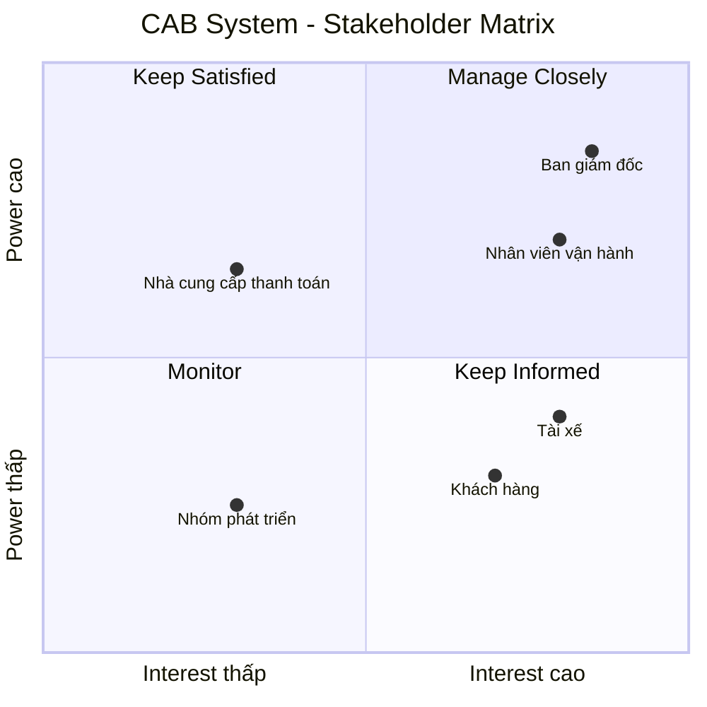

# 23700751_HuynhNhatTruong_CABSYSTEM
| STT | Yếu điểm                                             | Phân tích                                                                                                                                                        |
| --- | ---------------------------------------------------- | ---------------------------------------------------------------------------------------------------------------------------------------------------------------- |
| 1   | **Phân công tài xế chủ yếu thủ công**                | Việc tìm và phân công tài xế chưa được tự động hóa, gây mất thời gian và khó xử lý khi số lượng chuyến tăng.                                                     |
| 2   | **Khách hàng khó theo dõi chuyến đi**                | Khách hàng chưa dễ dàng biết hệ thống đang tìm tài xế, tài xế nào đã nhận chuyến hoặc trạng thái hiện tại của chuyến đi.                                         |
| 3   | **Thông tin thanh toán chưa được quản lý tập trung** | Việc quản lý và tra cứu thông tin thanh toán còn hạn chế.                                                                                                        |
| 4   | **Khó mở rộng hệ thống**                             | Hệ thống hiện tại gặp khó khăn khi doanh nghiệp muốn phục vụ số lượng lớn khách hàng và tài xế.                                                                  |
| 5   | **Quản lý tài xế chưa hiệu quả**                     | Chưa có cơ chế đầy đủ để quản lý trạng thái hoạt động, thông tin phương tiện và vị trí tài xế.                                                                   |
| 6   | **Khó xử lý khi tài xế từ chối hoặc không phản hồi** | Việc tìm tài xế thay thế cần được cải thiện để khách hàng không phải tạo lại yêu cầu.                                                                            |
| 7   | **Hỗ trợ thanh toán còn hạn chế**                    | Doanh nghiệp cần tích hợp với nhà cung cấp thanh toán bên ngoài và xử lý trường hợp giao dịch thất bại.                                                          |
| 8   | **Hệ thống thông báo chưa đáp ứng đầy đủ**           | Cần thông báo cho khách hàng và tài xế ở nhiều trạng thái khác nhau của chuyến đi.                                                                               |
| 9   | **Khó khăn trong công tác vận hành**                 | Nhân viên vận hành cần một giao diện quản trị để quản lý khách hàng, tài xế, phương tiện và chuyến đi.                                                           |
| 10  | **Khả năng mở rộng và thay đổi còn hạn chế**         | Doanh nghiệp muốn bổ sung dịch vụ, phương thức thanh toán, nhà cung cấp thông báo hoặc thay đổi thành phần kỹ thuật mà không phải xây dựng lại toàn bộ hệ thống. |

Tại sao cần hệ thống mới?

Do những hạn chế trên, doanh nghiệp cần xây dựng một CAB System mới nhằm:

Tự động hóa quy trình tìm và phân công tài xế dựa trên vị trí, trạng thái sẵn sàng và các tiêu chí vận hành.

Cho phép khách hàng theo dõi chuyến đi từ lúc tạo yêu cầu cho đến khi hoàn thành.

Quản lý thông tin khách hàng, tài xế, phương tiện và chuyến đi một cách tập trung.

Hỗ trợ tính cước và thanh toán, bao gồm cả tiền mặt và thanh toán điện tử.

Xử lý trường hợp tài xế không phản hồi hoặc từ chối chuyến bằng cách tiếp tục tìm tài xế khác.

Cung cấp hệ thống thông báo cho khách hàng và tài xế trong các trạng thái quan trọng.

Hỗ trợ nhân viên vận hành theo dõi chuyến đang diễn ra, trạng thái tài xế, sự cố và lịch sử giao dịch.

Cung cấp báo cáo cho ban lãnh đạo về số lượng chuyến, doanh thu, tỷ lệ hoàn thành, tỷ lệ hủy và hiệu quả hoạt động của tài xế.

Đảm bảo bảo mật và phân quyền đối với dữ liệu cá nhân, dữ liệu vị trí, dữ liệu giao dịch và các thao tác quản trị.

Có khả năng mở rộng độc lập, hạn chế việc một lỗi ở thanh toán hoặc thông báo làm ảnh hưởng toàn bộ hệ thống.

Dễ dàng phát triển trong tương lai, chẳng hạn như thêm loại dịch vụ, phương thức thanh toán hoặc nhà cung cấp thông báo.

B2. Xác định Stakeholder
| STT | Stakeholder                   | Vai trò / Mối quan tâm                                                                       |
| --- | ----------------------------- | -------------------------------------------------------------------------------------------- |
| 1   | **Khách hàng**                | Đăng ký, đặt xe, theo dõi chuyến, xem lịch sử, thanh toán và đánh giá tài xế.                |
| 2   | **Tài xế**                    | Quản lý hồ sơ, phương tiện, trạng thái hoạt động, nhận chuyến và cập nhật trạng thái chuyến. |
| 3   | **Nhân viên vận hành**        | Quản lý khách hàng, tài xế, phương tiện, chuyến đi và xử lý sự cố.                           |
| 4   | **Ban giám đốc**              | Đưa ra định hướng, theo dõi doanh thu, số lượng chuyến và hiệu quả hoạt động.                |
| 5   | **Bộ phận tài chính/kế toán** | Quan tâm đến doanh thu, thanh toán, giao dịch và dữ liệu tài chính của hệ thống.             |
| 6   | **Nhà cung cấp thanh toán**   | Cung cấp dịch vụ xử lý thanh toán điện tử bên ngoài.                                         |
| 7   | **Business Analyst (BA)**     | Làm rõ các yêu cầu chưa được xác định và xác nhận yêu cầu với các bên liên quan.             |
| 8   | **Nhóm phát triển hệ thống**  | Xây dựng và triển khai hệ thống dựa trên yêu cầu đã được xác nhận.                           |

# Stakeholder Matrix

|                | **Interest thấp** | **Interest cao** |
|----------------|-------------------|------------------|
| **Power cao**  | **Nhà cung cấp thanh toán** Ảnh hưởng đến hoạt động thanh toán nhưng không sử dụng hệ thống CAB trực tiếp. | **Ban giám đốc** Đưa ra định hướng và kỳ vọng đối với hệ thống.  **Nhân viên vận hành** Trực tiếp quản lý và xử lý hoạt động của hệ thống. |
| **Power thấp** | **Nhóm phát triển hệ thống** Xây dựng và triển khai hệ thống theo các yêu cầu đã được xác định. | **Khách hàng** Người sử dụng trực tiếp dịch vụ đặt xe.  **Tài xế** Người sử dụng trực tiếp hệ thống để nhận và thực hiện chuyến. |
## Stakeholder Matrix

#B3
| ID       | Business Goal                                           | Mô tả chi tiết                                                                                                                                                                                                     |
| -------- | ------------------------------------------------------- | ------------------------------------------------------------------------------------------------------------------------------------------------------------------------------------------------------------------ |
| **BG01** | **Tự động hóa quy trình đặt xe và phân công tài xế**    | Tự động xác định tài xế phù hợp dựa trên vị trí, trạng thái sẵn sàng và các tiêu chí vận hành. Khi tài xế không phản hồi hoặc từ chối, hệ thống tiếp tục tìm tài xế khác mà khách hàng không phải tạo lại yêu cầu. |
| **BG02** | **Nâng cao trải nghiệm khách hàng**                     | Cho phép khách hàng đăng ký, đặt xe, theo dõi quá trình tìm tài xế, biết tài xế đã nhận chuyến, thời gian dự kiến đến, trạng thái chuyến, lịch sử chuyến, số tiền phải trả và đánh giá tài xế.                     |
| **BG03** | **Nâng cao hiệu quả quản lý tài xế**                    | Quản lý hồ sơ, phương tiện, trạng thái hoạt động và vị trí tài xế; hỗ trợ tìm tài xế gần khách hàng và cải thiện khả năng dự kiến thời gian đến.                                                                   |
| **BG04** | **Quản lý thanh toán và tính cước hiệu quả**            | Tính số tiền khách hàng phải trả dựa trên loại dịch vụ và thông tin chuyến đi; hỗ trợ tiền mặt và thanh toán điện tử; tích hợp nhà cung cấp thanh toán bên ngoài và xử lý giao dịch thất bại.                      |
| **BG05** | **Cải thiện khả năng quản lý và vận hành doanh nghiệp** | Cung cấp giao diện quản trị để nhân viên quản lý khách hàng, tài xế, phương tiện, chuyến đi, theo dõi chuyến đang diễn ra, xử lý chuyến lỗi và tra cứu lịch sử giao dịch.                                          |
| **BG06** | **Cung cấp dữ liệu và báo cáo cho ban lãnh đạo**        | Cung cấp báo cáo về số lượng chuyến, doanh thu, tỷ lệ chuyến hoàn thành, tỷ lệ hủy và hiệu quả hoạt động của tài xế để hỗ trợ theo dõi hoạt động.                                                                  |
| **BG07** | **Đảm bảo tính ổn định và khả năng mở rộng**            | Hệ thống phải hoạt động ổn định khi nhu cầu tăng cao; lỗi ở thanh toán hoặc thông báo không được làm toàn bộ hệ thống đặt xe ngừng hoạt động; các thành phần có thể mở rộng độc lập khi tải tăng.                  |
| **BG08** | **Đảm bảo an toàn và bảo mật dữ liệu**                  | Xác thực khách hàng và tài xế, kiểm soát quyền truy cập các chức năng quản trị, bảo vệ thông tin cá nhân, phương tiện, vị trí và giao dịch, đồng thời lưu vết các thao tác quan trọng.                             |
| **BG09** | **Tạo nền tảng có khả năng phát triển lâu dài**         | Cho phép bổ sung loại dịch vụ mới, phương thức thanh toán mới, nhà cung cấp thông báo mới hoặc thay đổi thành phần kỹ thuật mà không phải xây dựng lại toàn bộ ứng dụng.                                           |
| **BG10** | **Hỗ trợ phối hợp giữa các bộ phận**                    | Cho phép các bộ phận trong doanh nghiệp phối hợp thông qua hệ thống và có đủ dữ liệu để theo dõi hoạt động.|                                                      

#B4
| STT   | Chức năng cốt lõi                | Nội dung chính                                                                                                  |
| ----- | -------------------------------- | --------------------------------------------------------------------------------------------------------------- |
| **1** | **Quản lý tài khoản**            | Đăng ký, đăng nhập, cập nhật thông tin khách hàng và tài xế.                                                    |
| **2** | **Đặt xe**                       | Khách hàng nhập điểm đón, điểm đến, chọn loại xe và gửi yêu cầu đặt xe.                                         |
| **3** | **Quản lý tài xế**              | Hệ thống tìm tài xế phù hợp dựa trên vị trí,tài xế nhận hoặc hủy, trạng thái sẵn sàng; xử lý khi tài xế từ chối hoặc không phản hồi. |
| **4** | **Quản lý & theo dõi chuyến đi** | Tài xế cập nhật trạng thái chuyến; khách hàng theo dõi tài xế và trạng thái chuyến đi.                          |
| **5** | **Tính cước & thanh toán**       | Tính số tiền phải trả, hỗ trợ tiền mặt và thanh toán điện tử thông qua nhà cung cấp bên ngoài.                  |
| **6** | **Thông báo**                    | Thông báo cho khách hàng và tài xế về các sự kiện quan trọng của chuyến đi và thanh toán.                       |
| **7** | **Quản lý sau chuyến đi**        | Lưu lịch sử chuyến, hiển thị số tiền phải trả và cho phép khách hàng đánh giá tài xế.                           |

#B5
| **ID**    | **Chức năng cốt lõi**            | **Business Requirement**                                                                   | **Chi tiết yêu cầu**                                                                                                                                                                                                                                                                                        |
| --------- | -------------------------------- | ------------------------------------------------------------------------------------------ | ----------------------------------------------------------------------------------------------------------------------------------------------------------------------------------------------------------------------------------------------------------------------------------------------------------- |
| **BR-01** | **Quản lý tài khoản**            | Hệ thống phải hỗ trợ quản lý tài khoản của khách hàng và tài xế.                           | Cho phép khách hàng đăng ký, đăng nhập và cập nhật thông tin cá nhân. Tài xế có thể đăng ký hoặc được nhân viên vận hành tạo tài khoản, cập nhật hồ sơ và thông tin phương tiện. Người dùng phải được xác thực trước khi sử dụng các chức năng yêu cầu tài khoản.                                           |
| **BR-02** | **Đặt xe**                       | Hệ thống phải cho phép khách hàng tạo và gửi yêu cầu đặt xe.                               | Khách hàng nhập điểm đón, điểm đến, lựa chọn loại xe và gửi yêu cầu. Sau khi gửi, hệ thống phải tiếp nhận yêu cầu và bắt đầu quá trình tìm tài xế.                                                                                                                                                          |
| **BR-03** | **Quản lý tài xế**               | Hệ thống phải hỗ trợ quản lý và phân công tài xế cho các yêu cầu đặt xe.                   | Hệ thống xác định tài xế phù hợp dựa trên vị trí, trạng thái sẵn sàng và các tiêu chí vận hành. Tài xế có thể nhận hoặc từ chối chuyến. Nếu tài xế không phản hồi hoặc từ chối, hệ thống tiếp tục tìm tài xế khác mà không yêu cầu khách hàng tạo lại yêu cầu.                                              |
| **BR-04** | **Quản lý & theo dõi chuyến đi** | Hệ thống phải quản lý trạng thái chuyến đi và cho phép khách hàng theo dõi chuyến.         | Tài xế cập nhật trạng thái **đã đến điểm đón, đã đón khách, đang di chuyển và hoàn thành chuyến**. Khách hàng có thể biết tài xế đã nhận chuyến, thời gian dự kiến tài xế đến và trạng thái hiện tại của chuyến đi.                                                                                         |
| **BR-05** | **Tính cước & thanh toán**       | Hệ thống phải tính số tiền khách hàng cần trả và hỗ trợ thanh toán.                        | Sau khi chuyến hoàn thành, hệ thống xác định số tiền phải trả dựa trên loại dịch vụ và thông tin chuyến đi. Hỗ trợ thanh toán tiền mặt và thanh toán điện tử thông qua nhà cung cấp bên ngoài. Nếu thanh toán điện tử thất bại, hệ thống phải thông báo và cho phép xử lý lại theo chính sách doanh nghiệp. |
| **BR-06** | **Thông báo**                    | Hệ thống phải cung cấp thông báo cho khách hàng và tài xế trong quá trình sử dụng dịch vụ. | Khách hàng nhận thông báo khi yêu cầu được tiếp nhận, tài xế nhận chuyến, tài xế đến điểm đón, chuyến hoàn thành và thanh toán có kết quả. Tài xế nhận thông báo về chuyến mới và các thay đổi liên quan đến chuyến đang thực hiện.                                                                         |
| **BR-07** | **Quản lý sau chuyến đi**        | Hệ thống phải hỗ trợ quản lý thông tin sau khi chuyến đi hoàn thành.                       | Khách hàng có thể xem lịch sử chuyến đi, số tiền phải trả và đánh giá tài xế. Hệ thống lưu thông tin chuyến và giao dịch để phục vụ việc tra cứu và quản lý.                                                                                                                                               |

#B6
Functional Requirements – CAB System
| **ID**       | **Business Requirement**  | **Functional Requirement**        | **Mô tả chức năng**                                                                                        |
| ------------ | ------------------------- | --------------------------------- | ---------------------------------------------------------------------------------------------------------- |
| **FR-01.01** | BR-01 – Quản lý tài khoản | **Đăng ký tài khoản khách hàng**  | Hệ thống phải cho phép khách hàng tạo tài khoản mới bằng cách cung cấp các thông tin cần thiết.            |
| **FR-01.02** | BR-01 – Quản lý tài khoản | **Đăng nhập**                     | Hệ thống phải cho phép khách hàng và tài xế đăng nhập bằng tài khoản đã đăng ký.                           |
| **FR-01.03** | BR-01 – Quản lý tài khoản | **Cập nhật thông tin cá nhân**    | Hệ thống phải cho phép khách hàng cập nhật thông tin cá nhân của mình.                                     |
| **FR-01.04** | BR-01 – Quản lý tài khoản | **Quản lý tài khoản tài xế**      | Hệ thống phải cho phép tài xế đăng ký hoặc được nhân viên vận hành tạo tài khoản và cập nhật hồ sơ tài xế. |
| **FR-01.05** | BR-01 – Quản lý tài khoản | **Quản lý thông tin phương tiện** | Hệ thống phải cho phép tài xế cập nhật thông tin phương tiện của mình.                                     |
| **FR-01.06** | BR-01 – Quản lý tài khoản | **Xác thực người dùng**           | Hệ thống phải xác thực khách hàng và tài xế trước khi cho phép sử dụng các chức năng yêu cầu tài khoản.    |

| **ID**       | **Business Requirement** | **Functional Requirement**      | **Mô tả chức năng**                                                                           |
| ------------ | ------------------------ | ------------------------------- | --------------------------------------------------------------------------------------------- |
| **FR-02.01** | BR-02 – Đặt xe           | **Nhập thông tin chuyến đi**    | Hệ thống phải cho phép khách hàng nhập điểm đón và điểm đến.                                  |
| **FR-02.02** | BR-02 – Đặt xe           | **Lựa chọn loại xe**            | Hệ thống phải cho phép khách hàng lựa chọn loại xe/dịch vụ phù hợp.                           |
| **FR-02.03** | BR-02 – Đặt xe           | **Gửi yêu cầu đặt xe**          | Hệ thống phải cho phép khách hàng gửi yêu cầu đặt xe sau khi nhập đầy đủ thông tin cần thiết. |
| **FR-02.04** | BR-02 – Đặt xe           | **Tiếp nhận yêu cầu đặt xe**    | Hệ thống phải tiếp nhận yêu cầu và chuyển sang quá trình tìm tài xế phù hợp.                  |
| **FR-02.05** | BR-02 – Đặt xe           | **Thông báo tiếp nhận yêu cầu** | Hệ thống phải thông báo cho khách hàng khi yêu cầu đặt xe được tiếp nhận.                     |

| **ID**       | **Business Requirement** | **Functional Requirement**      | **Mô tả chức năng**                                                                           |
| ------------ | ------------------------ | ------------------------------- | --------------------------------------------------------------------------------------------- |
| **FR-02.01** | BR-02 – Đặt xe           | **Nhập thông tin chuyến đi**    | Hệ thống phải cho phép khách hàng nhập điểm đón và điểm đến.                                  |
| **FR-02.02** | BR-02 – Đặt xe           | **Lựa chọn loại xe**            | Hệ thống phải cho phép khách hàng lựa chọn loại xe/dịch vụ phù hợp.                           |
| **FR-02.03** | BR-02 – Đặt xe           | **Gửi yêu cầu đặt xe**          | Hệ thống phải cho phép khách hàng gửi yêu cầu đặt xe sau khi nhập đầy đủ thông tin cần thiết. |
| **FR-02.04** | BR-02 – Đặt xe           | **Tiếp nhận yêu cầu đặt xe**    | Hệ thống phải tiếp nhận yêu cầu và chuyển sang quá trình tìm tài xế phù hợp.                  |
| **FR-02.05** | BR-02 – Đặt xe           | **Thông báo tiếp nhận yêu cầu** | Hệ thống phải thông báo cho khách hàng khi yêu cầu đặt xe được tiếp nhận.                     |

| **ID**       | **Business Requirement** | **Functional Requirement**          | **Mô tả chức năng**                                                                                                         |
| ------------ | ------------------------ | ----------------------------------- | --------------------------------------------------------------------------------------------------------------------------- |
| **FR-03.01** | BR-03 – Quản lý tài xế   | **Kiểm tra tài xế sẵn sàng**        | Hệ thống phải xác định các tài xế đang ở trạng thái sẵn sàng nhận chuyến.                                                   |
| **FR-03.02** | BR-03 – Quản lý tài xế   | **Xác định tài xế phù hợp**         | Hệ thống phải xác định tài xế phù hợp dựa trên vị trí, trạng thái sẵn sàng và các tiêu chí vận hành khác.                   |
| **FR-03.03** | BR-03 – Quản lý tài xế   | **Ưu tiên tài xế**                  | Hệ thống phải ưu tiên các tài xế phù hợp và gần khách hàng theo các tiêu chí được doanh nghiệp xác định.                    |
| **FR-03.04** | BR-03 – Quản lý tài xế   | **Gửi yêu cầu chuyến cho tài xế**   | Hệ thống phải gửi thông tin yêu cầu chuyến đến tài xế phù hợp.                                                              |
| **FR-03.05** | BR-03 – Quản lý tài xế   | **Nhận chuyến**                     | Hệ thống phải ghi nhận khi tài xế chấp nhận yêu cầu chuyến.                                                                 |
| **FR-03.06** | BR-03 – Quản lý tài xế   | **Từ chối chuyến**                  | Hệ thống phải ghi nhận khi tài xế từ chối yêu cầu chuyến.                                                                   |
| **FR-03.07** | BR-03 – Quản lý tài xế   | **Xử lý tài xế không phản hồi**     | Hệ thống phải xử lý trường hợp tài xế được đề xuất nhưng không phản hồi và tiếp tục tìm tài xế khác.                        |
| **FR-03.08** | BR-03 – Quản lý tài xế   | **Tìm tài xế thay thế**             | Khi tài xế từ chối hoặc không phản hồi, hệ thống phải tiếp tục tìm tài xế khác mà không yêu cầu khách hàng tạo lại yêu cầu. |
| **FR-03.09** | BR-03 – Quản lý tài xế   | **Thông báo không tìm được tài xế** | Hệ thống phải thông báo rõ ràng cho khách hàng khi không tìm được tài xế phù hợp.                                           |

| **ID**       | **Business Requirement**             | **Functional Requirement**              | **Mô tả chức năng**                                                                                     |
| ------------ | ------------------------------------ | --------------------------------------- | ------------------------------------------------------------------------------------------------------- |
| **FR-04.01** | BR-04 – Quản lý & theo dõi chuyến đi | **Ghi nhận tài xế nhận chuyến**         | Hệ thống phải ghi nhận tài xế đã nhận yêu cầu và cập nhật thông tin cho khách hàng.                     |
| **FR-04.02** | BR-04 – Quản lý & theo dõi chuyến đi | **Cập nhật trạng thái đã đến điểm đón** | Hệ thống phải cho phép tài xế cập nhật trạng thái khi đã đến điểm đón.                                  |
| **FR-04.03** | BR-04 – Quản lý & theo dõi chuyến đi | **Cập nhật trạng thái đã đón khách**    | Hệ thống phải cho phép tài xế cập nhật trạng thái sau khi đã đón khách.                                 |
| **FR-04.04** | BR-04 – Quản lý & theo dõi chuyến đi | **Cập nhật trạng thái đang di chuyển**  | Hệ thống phải cho phép tài xế cập nhật trạng thái khi đang thực hiện chuyến.                            |
| **FR-04.05** | BR-04 – Quản lý & theo dõi chuyến đi | **Cập nhật trạng thái hoàn thành**      | Hệ thống phải cho phép tài xế cập nhật trạng thái khi chuyến đi hoàn thành.                             |
| **FR-04.06** | BR-04 – Quản lý & theo dõi chuyến đi | **Theo dõi tài xế**                     | Hệ thống phải cung cấp thông tin để khách hàng theo dõi tài xế trong quá trình chờ và thực hiện chuyến. |
| **FR-04.07** | BR-04 – Quản lý & theo dõi chuyến đi | **Hiển thị thời gian dự kiến đến**      | Hệ thống phải cung cấp thời gian dự kiến tài xế đến cho khách hàng.                                     |
| **FR-04.08** | BR-04 – Quản lý & theo dõi chuyến đi | **Hiển thị trạng thái chuyến**          | Hệ thống phải cho phép khách hàng xem trạng thái hiện tại của chuyến đi.                                |

| **ID**       | **Business Requirement**       | **Functional Requirement**      | **Mô tả chức năng**                                                                                                          |
| ------------ | ------------------------------ | ------------------------------- | ---------------------------------------------------------------------------------------------------------------------------- |
| **FR-05.01** | BR-05 – Tính cước & thanh toán | **Tính cước chuyến đi**         | Sau khi chuyến hoàn thành, hệ thống phải xác định số tiền khách hàng cần trả dựa trên loại dịch vụ và thông tin chuyến đi.   |
| **FR-05.02** | BR-05 – Tính cước & thanh toán | **Hiển thị số tiền phải trả**   | Hệ thống phải cung cấp số tiền khách hàng cần thanh toán.                                                                    |
| **FR-05.03** | BR-05 – Tính cước & thanh toán | **Thanh toán tiền mặt**         | Hệ thống phải hỗ trợ phương thức thanh toán bằng tiền mặt.                                                                   |
| **FR-05.04** | BR-05 – Tính cước & thanh toán | **Thanh toán điện tử**          | Hệ thống phải hỗ trợ thanh toán điện tử thông qua nhà cung cấp thanh toán bên ngoài.                                         |
| **FR-05.05** | BR-05 – Tính cước & thanh toán | **Xử lý kết quả thanh toán**    | Hệ thống phải ghi nhận và thông báo kết quả của giao dịch thanh toán.                                                        |
| **FR-05.06** | BR-05 – Tính cước & thanh toán | **Xử lý thanh toán thất bại**   | Khi giao dịch điện tử thất bại, hệ thống phải thông báo cho khách hàng và hỗ trợ xử lý lại theo chính sách của doanh nghiệp. |
| **FR-05.07** | BR-05 – Tính cước & thanh toán | **Bảo vệ thông tin thanh toán** | Hệ thống CAB không được lưu trực tiếp thông tin nhạy cảm của thẻ hoặc tài khoản thanh toán.                                  |

| **ID**       | **Business Requirement** | **Functional Requirement**          | **Mô tả chức năng**                                                                     |
| ------------ | ------------------------ | ----------------------------------- | --------------------------------------------------------------------------------------- |
| **FR-06.01** | BR-06 – Thông báo        | **Thông báo tiếp nhận yêu cầu**     | Hệ thống phải thông báo cho khách hàng khi yêu cầu đặt xe được tiếp nhận.               |
| **FR-06.02** | BR-06 – Thông báo        | **Thông báo tài xế nhận chuyến**    | Hệ thống phải thông báo cho khách hàng khi có tài xế nhận chuyến.                       |
| **FR-06.03** | BR-06 – Thông báo        | **Thông báo tài xế đến**            | Hệ thống phải thông báo cho khách hàng khi tài xế đến điểm đón.                         |
| **FR-06.04** | BR-06 – Thông báo        | **Thông báo hoàn thành chuyến**     | Hệ thống phải thông báo cho khách hàng khi chuyến đi hoàn thành.                        |
| **FR-06.05** | BR-06 – Thông báo        | **Thông báo kết quả thanh toán**    | Hệ thống phải thông báo cho khách hàng kết quả thanh toán.                              |
| **FR-06.06** | BR-06 – Thông báo        | **Thông báo chuyến mới cho tài xế** | Hệ thống phải gửi thông báo cho tài xế khi có yêu cầu chuyến mới phù hợp.               |
| **FR-06.07** | BR-06 – Thông báo        | **Thông báo thay đổi chuyến**       | Hệ thống phải thông báo cho tài xế khi có thay đổi liên quan đến chuyến đang thực hiện. |

| **ID**       | **Business Requirement**      | **Functional Requirement**  | **Mô tả chức năng**                                                                   |
| ------------ | ----------------------------- | --------------------------- | ------------------------------------------------------------------------------------- |
| **FR-07.01** | BR-07 – Quản lý sau chuyến đi | **Lưu lịch sử chuyến đi**   | Hệ thống phải lưu thông tin các chuyến đi đã hoàn thành để khách hàng có thể tra cứu. |
| **FR-07.02** | BR-07 – Quản lý sau chuyến đi | **Xem lịch sử chuyến đi**   | Hệ thống phải cho phép khách hàng xem lịch sử các chuyến đã thực hiện.                |
| **FR-07.03** | BR-07 – Quản lý sau chuyến đi | **Xem số tiền phải trả**    | Hệ thống phải cho phép khách hàng xem số tiền phải trả của chuyến đi.                 |
| **FR-07.04** | BR-07 – Quản lý sau chuyến đi | **Đánh giá tài xế**         | Hệ thống phải cho phép khách hàng đánh giá tài xế sau khi chuyến đi hoàn thành.       |
| **FR-07.05** | BR-07 – Quản lý sau chuyến đi | **Lưu thông tin giao dịch** | Hệ thống phải lưu thông tin giao dịch để phục vụ việc tra cứu và quản lý.             |

#B7: vẽ usecase 

#B8: đặc tả usecases

#B9: phân tích business process(phân tích quy trình nghiệp vụ)

#B10: phân tích các quy tắc nghiệp vụ (businees rules)

