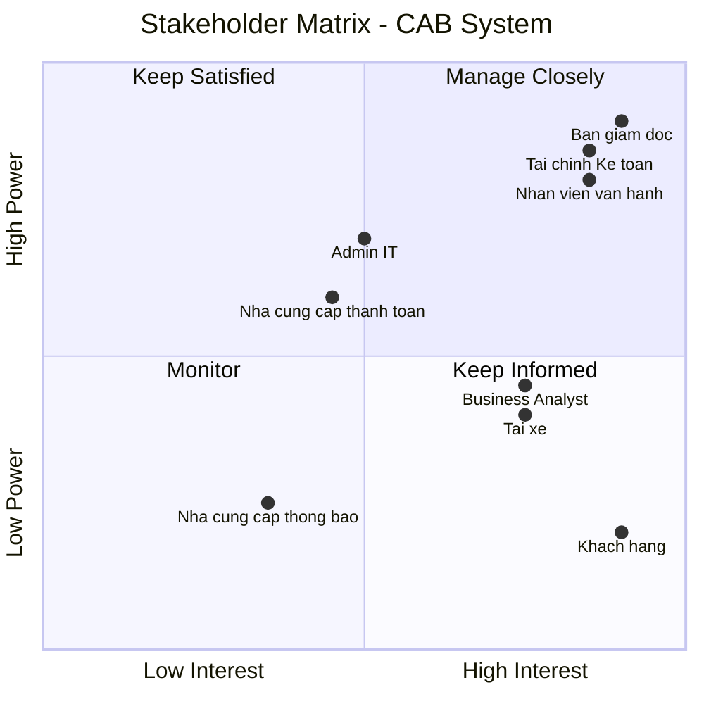
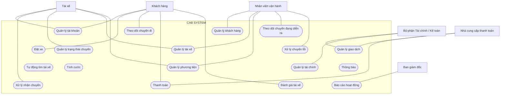

# 23700751_HuynhNhatTruong_CABSYSTEM
# Giai đoạn 1
| STT | Yếu điểm                                             | Phân tích                                                                                                                                                        |
| --- | ---------------------------------------------------- | ---------------------------------------------------------------------------------------------------------------------------------------------------------------- |
| 1   | **Phân công tài xế chủ yếu thủ công**                | Việc tìm và phân công tài xế chưa được tự động hóa, gây mất thời gian và khó xử lý khi số lượng chuyến tăng.                                                     |
| 2   | **Khách hàng khó theo dõi chuyến đi**                | Khách hàng chưa dễ dàng biết hệ thống đang tìm tài xế, tài xế nào đã nhận chuyến hoặc trạng thái hiện tại của chuyến đi.                                         |
| 3   | **Thông tin thanh toán chưa được quản lý tập trung** | Việc quản lý và tra cứu thông tin thanh toán còn hạn chế.                                                                                                        |
| 4   | **Khó mở rộng hệ thống**                             | Hệ thống hiện tại gặp khó khăn khi doanh nghiệp muốn phục vụ số lượng lớn khách hàng và tài xế.                                                                  |
| 5   | **Quản lý tài xế chưa hiệu quả**                     | Chưa có cơ chế đầy đủ để quản lý trạng thái hoạt động, thông tin phương tiện và vị trí tài xế.                                                                   |
| 6   | **Khó xử lý khi tài xế từ chối hoặc không phản hồi** | Việc tìm tài xế thay thế cần được cải thiện để khách hàng không phải tạo lại yêu cầu.                                                                            |
| 7   | **Hỗ trợ thanh toán còn hạn chế**                    | Doanh nghiệp cần tích hợp với nhà cung cấp thanh toán bên ngoài và xử lý trường hợp giao dịch thất bại.                                                          |
| 8   | **Hệ thống thông báo chưa đáp ứng đầy đủ**           | Cần thông báo cho khách hàng và tài xế ở nhiều trạng thái khác nhau của chuyến đi.                                                                               |
| 9   | **Khó khăn trong công tác vận hành**                 | Nhân viên vận hành cần một giao diện quản trị để quản lý khách hàng, tài xế, phương tiện và chuyến đi.                                                           |
| 10  | **Khả năng mở rộng và thay đổi còn hạn chế**         | Doanh nghiệp muốn bổ sung dịch vụ, phương thức thanh toán, nhà cung cấp thông báo hoặc thay đổi thành phần kỹ thuật mà không phải xây dựng lại toàn bộ hệ thống. |

**Tại sao cần hệ thống mới?**

Do những hạn chế trên, doanh nghiệp cần xây dựng một CAB System mới nhằm:

Tự động hóa quy trình tìm và phân công tài xế dựa trên vị trí, trạng thái sẵn sàng và các tiêu chí vận hành.

Cho phép khách hàng theo dõi chuyến đi từ lúc tạo yêu cầu cho đến khi hoàn thành.

Quản lý thông tin khách hàng, tài xế, phương tiện và chuyến đi một cách tập trung.

Hỗ trợ tính cước và thanh toán, bao gồm cả tiền mặt và thanh toán điện tử.

Xử lý trường hợp tài xế không phản hồi hoặc từ chối chuyến bằng cách tiếp tục tìm tài xế khác.

Cung cấp hệ thống thông báo cho khách hàng và tài xế trong các trạng thái quan trọng.

Hỗ trợ nhân viên vận hành theo dõi chuyến đang diễn ra, trạng thái tài xế, sự cố và lịch sử giao dịch.

Cung cấp báo cáo cho ban lãnh đạo về số lượng chuyến, doanh thu, tỷ lệ hoàn thành, tỷ lệ hủy và hiệu quả hoạt động của tài xế.

Đảm bảo bảo mật và phân quyền đối với dữ liệu cá nhân, dữ liệu vị trí, dữ liệu giao dịch và các thao tác quản trị.

Có khả năng mở rộng độc lập, hạn chế việc một lỗi ở thanh toán hoặc thông báo làm ảnh hưởng toàn bộ hệ thống.

Dễ dàng phát triển trong tương lai, chẳng hạn như thêm loại dịch vụ, phương thức thanh toán hoặc nhà cung cấp thông báo.

# Giai đoạn 2 Xác định Stakeholder
| **STT** | **Stakeholder**                    | **Vai trò / Mối quan tâm**                                                                                 |
| ------: | ---------------------------------- | ---------------------------------------------------------------------------------------------------------- |
|       1 | **Khách hàng**                     | Đăng ký, đặt xe, theo dõi chuyến, xem lịch sử, thanh toán và đánh giá tài xế.                              |
|       2 | **Tài xế**                         | Quản lý hồ sơ, phương tiện, trạng thái hoạt động, nhận chuyến và cập nhật trạng thái chuyến.               |
|       3 | **Nhân viên vận hành**             | Quản lý khách hàng, tài xế, phương tiện, chuyến đi và xử lý các trường hợp phát sinh.                      |
|       4 | **Ban giám đốc**                   | Đưa ra định hướng, theo dõi doanh thu, số lượng chuyến, tỷ lệ hoàn thành và hiệu quả hoạt động.            |
|       5 | **Bộ phận Tài chính**              | Quản lý doanh thu, thanh toán, giao dịch, đối soát và dữ liệu tài chính của hệ thống.                      |
|       6 | **Quản trị hệ thống**              | Quản lý tài khoản, phân quyền, bảo mật và đảm bảo hệ thống hoạt động ổn định.                              |
|       7 | **Nhà cung cấp thanh toán**        | Cung cấp dịch vụ xử lý thanh toán điện tử bên ngoài và trả kết quả giao dịch cho hệ thống.                 |
|       8 | **Nhà cung cấp dịch vụ thông báo** | Cung cấp dịch vụ gửi thông báo đến khách hàng và tài xế thông qua các kênh được tích hợp.                  |
|       9 | **Business Analyst (BA)**          | Thu thập, phân tích, làm rõ các yêu cầu chưa xác định và xác nhận yêu cầu với các bên liên quan.           |

# Stakeholder Matrix
|                | **Interest thấp**                                                                                                                                                                                                                    | **Interest cao**                                                                                                                                                                                                                                                                                                  |
| -------------- | ------------------------------------------------------------------------------------------------------------------------------------------------------------------------------------------------------------------------------------ | ----------------------------------------------------------------------------------------------------------------------------------------------------------------------------------------------------------------------------------------------------------------------------------------------------------------- |
| **Power cao**  | **Nhà cung cấp thanh toán** Ảnh hưởng đến hoạt động thanh toán nhưng không sử dụng hệ thống CAB trực tiếp.  **Admin/IT** Quản lý hệ thống, bảo mật và quyền truy cập nhưng không trực tiếp sử dụng các nghiệp vụ đặt xe. | **Ban giám đốc** Đưa ra định hướng, mục tiêu và kỳ vọng đối với hệ thống.  **Nhân viên vận hành** Trực tiếp quản lý, theo dõi và xử lý các hoạt động của hệ thống.  **Bộ phận Tài chính/Kế toán** Quản lý thanh toán, doanh thu, giao dịch và đối soát.                                      |
| **Power thấp** | **Nhà cung cấp dịch vụ thông báo** Cung cấp dịch vụ gửi thông báo nhưng không trực tiếp tham gia vào hoạt động nghiệp vụ của hệ thống.                                                                                            | **Khách hàng** Người sử dụng trực tiếp dịch vụ để đặt xe, theo dõi chuyến, thanh toán và đánh giá tài xế.  **Tài xế** Người sử dụng hệ thống để nhận chuyến, cập nhật trạng thái và thực hiện chuyến.  **Business Analyst (BA)** Thu thập, phân tích và làm rõ yêu cầu từ các bên liên quan. |

## Stakeholder Matrix

# Giai đoạn 3
| **ID** | **Business Goal**                                       | **Mô tả chi tiết**                                                                                                                                                                                                 |
| -----: | ------------------------------------------------------- | ------------------------------------------------------------------------------------------------------------------------------------------------------------------------------------------------------------------ |
|  **1** | **Tự động hóa quy trình đặt xe và phân công tài xế**    | Tự động xác định tài xế phù hợp dựa trên vị trí, trạng thái sẵn sàng và các tiêu chí vận hành. Khi tài xế không phản hồi hoặc từ chối, hệ thống tiếp tục tìm tài xế khác mà khách hàng không phải tạo lại yêu cầu. |
|  **2** | **Nâng cao trải nghiệm khách hàng**                     | Cho phép khách hàng đăng ký, đặt xe, theo dõi quá trình tìm tài xế, biết tài xế đã nhận chuyến, thời gian dự kiến đến, trạng thái chuyến, lịch sử chuyến, số tiền phải trả và đánh giá tài xế.                     |
|  **3** | **Nâng cao hiệu quả quản lý tài xế**                    | Quản lý hồ sơ, phương tiện, trạng thái hoạt động và vị trí tài xế; hỗ trợ tìm tài xế gần khách hàng và cải thiện khả năng dự kiến thời gian đến.                                                                   |
|  **4** | **Quản lý thanh toán và tính cước hiệu quả**            | Tính số tiền khách hàng phải trả dựa trên loại dịch vụ và thông tin chuyến đi; hỗ trợ thanh toán tiền mặt và thanh toán điện tử; tích hợp nhà cung cấp thanh toán bên ngoài và xử lý giao dịch thất bại.           |
|  **5** | **Cải thiện khả năng quản lý và vận hành doanh nghiệp** | Cung cấp giao diện quản trị để nhân viên quản lý khách hàng, tài xế, phương tiện, chuyến đi, theo dõi chuyến đang diễn ra, xử lý chuyến lỗi và tra cứu lịch sử giao dịch.                                          |
|  **6** | **Cung cấp dữ liệu và báo cáo cho ban lãnh đạo**        | Cung cấp báo cáo về số lượng chuyến, doanh thu, tỷ lệ chuyến hoàn thành, tỷ lệ hủy và hiệu quả hoạt động của tài xế để hỗ trợ theo dõi và ra quyết định.                                                           |
|  **7** | **Đảm bảo tính ổn định và khả năng mở rộng**            | Hệ thống phải hoạt động ổn định khi nhu cầu tăng cao; lỗi ở thanh toán hoặc thông báo không được làm toàn bộ hệ thống đặt xe ngừng hoạt động; các thành phần có thể mở rộng độc lập khi tải tăng.                  |
|  **8** | **Đảm bảo an toàn và bảo mật dữ liệu**                  | Xác thực khách hàng và tài xế, kiểm soát quyền truy cập các chức năng quản trị, bảo vệ thông tin cá nhân, phương tiện, vị trí và giao dịch, đồng thời lưu vết các thao tác quan trọng.                             |
|  **9** | **Tạo nền tảng có khả năng phát triển lâu dài**         | Cho phép bổ sung loại dịch vụ mới, phương thức thanh toán mới, nhà cung cấp thông báo mới hoặc thay đổi thành phần kỹ thuật mà không phải xây dựng lại toàn bộ ứng dụng.                                           |
| **10** | **Hỗ trợ phối hợp giữa các bộ phận**                    | Cho phép các bộ phận trong doanh nghiệp phối hợp thông qua hệ thống và có đủ dữ liệu để theo dõi hoạt động.                                                                                                        |
                                                      

# Giai đoạn 4
| **STT** | **Phạm vi**                 | **Nội dung thực hiện**                                                    |
| ------: | --------------------------- | ------------------------------------------------------------------------- |
|   **1** | **Quản lý tài khoản**       | Đăng ký, đăng nhập, đăng xuất và cập nhật thông tin người dùng.           |
|   **2** | **Quản lý khách hàng**      | Quản lý thông tin khách hàng và lịch sử chuyến đi.                        |
|   **3** | **Quản lý tài xế**          | Quản lý hồ sơ, phương tiện, trạng thái hoạt động và vị trí tài xế.        |
|   **4** | **Đặt xe**                  | Nhập điểm đón, điểm đến, chọn loại xe và gửi yêu cầu đặt xe.              |
|   **5** | **Tìm tài xế**              | Tự động tìm và phân công tài xế phù hợp với yêu cầu.                      |
|   **6** | **Quản lý chuyến đi**       | Nhận chuyến, đến điểm đón, đón khách, di chuyển và hoàn thành chuyến.     |
|   **7** | **Theo dõi chuyến**         | Cho phép khách hàng theo dõi tài xế và trạng thái chuyến đi.              |
|   **8** | **Tính cước và thanh toán** | Tính cước, hỗ trợ tiền mặt và thanh toán trực tuyến.                      |
|   **9** | **Thông báo**               | Gửi thông báo về đặt xe, tài xế, trạng thái chuyến và thanh toán.         |
|  **10** | **Đánh giá**                | Cho phép khách hàng đánh giá tài xế sau khi hoàn thành chuyến.            |
|  **11** | **Quản lý vận hành**        | Theo dõi khách hàng, tài xế, chuyến đi và xử lý các trường hợp phát sinh. |
|  **12** | **Quản lý tài chính**       | Theo dõi giao dịch, doanh thu và hỗ trợ đối soát.                         |

# Giai đoạn 5
| **ID** | **Business Requirement**      | **Mô tả chi tiết**                                                                                                                                                  |
| -----: | ----------------------------- | ------------------------------------------------------------------------------------------------------------------------------------------------------------------- |
|  **BR-01** | **Quản lý tài khoản**         | Hệ thống cho phép khách hàng, tài xế và nhân viên đăng nhập để sử dụng các chức năng phù hợp với vai trò.                                                           |
|  **BR-02** | **Quản lý khách hàng**        | Hệ thống cho phép quản lý thông tin khách hàng, trạng thái tài khoản và lịch sử chuyến đi.                                                                          |
|  **BR-03** | **Quản lý tài xế**            | Hệ thống cho phép quản lý hồ sơ tài xế, phương tiện, trạng thái hoạt động và vị trí tài xế.                                                                         |
|  **BR-04** | **Đặt xe**                    | Hệ thống cho phép khách hàng nhập điểm đón, điểm đến, lựa chọn loại xe và gửi yêu cầu đặt xe.                                                                       |
|  **BR-05** | **Tự động tìm tài xế**        | Hệ thống tự động tìm tài xế phù hợp dựa trên vị trí, trạng thái sẵn sàng, loại xe và các tiêu chí vận hành.                                                         |
|  **BR-06** | **Xử lý nhận chuyến**         | Hệ thống cho phép tài xế nhận hoặc từ chối yêu cầu chuyến. Khi tài xế từ chối hoặc không phản hồi, hệ thống tiếp tục tìm tài xế khác.                               |
|  **BR-07** | **Theo dõi chuyến đi**        | Hệ thống cho phép khách hàng theo dõi tài xế, thời gian dự kiến đến và trạng thái chuyến trong quá trình thực hiện.                                                 |
|  **BR-08** | **Quản lý trạng thái chuyến** | Hệ thống hỗ trợ cập nhật trạng thái từ khi tìm tài xế, nhận chuyến, đến điểm đón, đón khách, di chuyển đến khi hoàn thành.                                          |
|  **BR-09** | **Tính cước**                 | Hệ thống xác định số tiền khách hàng phải trả dựa trên loại dịch vụ và thông tin chuyến đi.                                                                         |
| **BR-010** | **Thanh toán**                | Hệ thống cho phép khách hàng thanh toán bằng tiền mặt hoặc phương thức thanh toán điện tử thông qua nhà cung cấp bên ngoài.                                         |
| **BR-011** | **Quản lý giao dịch**         | Hệ thống ghi nhận trạng thái giao dịch và xử lý các trường hợp thanh toán thành công hoặc thất bại.                                                                 |
| **BR-012** | **Thông báo**                 | Hệ thống gửi thông báo cho khách hàng và tài xế khi có các sự kiện quan trọng liên quan đến đặt xe, chuyến đi và thanh toán.                                        |
| **BR-013** | **Đánh giá tài xế**           | Hệ thống cho phép khách hàng đánh giá tài xế sau khi chuyến đi hoàn thành.                                                                                          |
| **BR-014** | **Quản lý vận hành**          | Hệ thống cho phép nhân viên vận hành quản lý khách hàng, tài xế, phương tiện, chuyến đi và xử lý các trường hợp phát sinh.                                          |
| **BR-015** | **Quản lý tài chính**         | Hệ thống hỗ trợ bộ phận Tài chính/Kế toán tra cứu giao dịch, theo dõi doanh thu và đối soát thanh toán.                                                             |
| **BR-016** | **Báo cáo hoạt động**         | Hệ thống cung cấp dữ liệu về số lượng chuyến, doanh thu, tỷ lệ hoàn thành, tỷ lệ hủy và hiệu quả hoạt động của tài xế.  
                                              
# Giai đoạn 6
Functional Requirements – CAB System
| **ID**       | **Business Requirement**  | **Functional Requirement**       | **Mô tả chức năng**                                                                                        |
| ------------ | ------------------------- | -------------------------------- | ---------------------------------------------------------------------------------------------------------- |
| **FR-01.01** | BR-01 – Quản lý tài khoản | **Đăng ký tài khoản khách hàng** | Hệ thống phải cho phép khách hàng tạo tài khoản mới bằng cách cung cấp các thông tin cần thiết.            |
| **FR-01.02** | BR-01 – Quản lý tài khoản | **Đăng nhập**                    | Hệ thống phải cho phép khách hàng, tài xế và nhân viên đăng nhập bằng tài khoản đã được cấp hoặc đăng ký.  |
| **FR-01.03** | BR-01 – Quản lý tài khoản | **Đăng xuất**                    | Hệ thống phải cho phép người dùng đăng xuất khỏi tài khoản sau khi sử dụng hệ thống.                       |
| **FR-01.04** | BR-01 – Quản lý tài khoản | **Cập nhật thông tin cá nhân**   | Hệ thống phải cho phép người dùng cập nhật thông tin cá nhân của mình.                                     |
| **FR-01.05** | BR-01 – Quản lý tài khoản | **Quản lý tài khoản tài xế**     | Hệ thống phải cho phép tài xế đăng ký hoặc được nhân viên vận hành tạo tài khoản và cập nhật hồ sơ tài xế. |
| **FR-01.06** | BR-01 – Quản lý tài khoản | **Xác thực người dùng**          | Hệ thống phải xác thực người dùng trước khi cho phép sử dụng các chức năng yêu cầu tài khoản.              |
| **FR-01.07** | BR-01 – Quản lý tài khoản | **Phân quyền người dùng**        | Hệ thống phải phân quyền chức năng dựa trên vai trò của khách hàng, tài xế và nhân viên.                   |

| **ID**       | **Business Requirement**   | **Functional Requirement**        | **Mô tả chức năng**                                                                              |
| ------------ | -------------------------- | --------------------------------- | ------------------------------------------------------------------------------------------------ |
| **FR-02.01** | BR-02 – Quản lý khách hàng | **Xem danh sách khách hàng**      | Hệ thống phải cho phép nhân viên vận hành xem danh sách khách hàng.                              |
| **FR-02.02** | BR-02 – Quản lý khách hàng | **Xem thông tin khách hàng**      | Hệ thống phải cho phép nhân viên vận hành xem thông tin chi tiết của khách hàng.                 |
| **FR-02.03** | BR-02 – Quản lý khách hàng | **Cập nhật thông tin khách hàng** | Hệ thống phải cho phép cập nhật thông tin khách hàng khi cần thiết.                              |
| **FR-02.04** | BR-02 – Quản lý khách hàng | **Quản lý trạng thái tài khoản**  | Hệ thống phải cho phép nhân viên vận hành quản lý trạng thái hoạt động của tài khoản khách hàng. |
| **FR-02.05** | BR-02 – Quản lý khách hàng | **Xem lịch sử chuyến đi**         | Hệ thống phải cho phép xem lịch sử các chuyến đi của khách hàng.                                 |

| **ID**       | **Business Requirement** | **Functional Requirement**        | **Mô tả chức năng**                                                                            |
| ------------ | ------------------------ | --------------------------------- | ---------------------------------------------------------------------------------------------- |
| **FR-03.01** | BR-03 – Quản lý tài xế   | **Quản lý hồ sơ tài xế**          | Hệ thống phải cho phép tài xế và nhân viên vận hành quản lý thông tin hồ sơ tài xế.            |
| **FR-03.02** | BR-03 – Quản lý tài xế   | **Quản lý phương tiện**           | Hệ thống phải cho phép tài xế cập nhật thông tin phương tiện được sử dụng để thực hiện chuyến. |
| **FR-03.03** | BR-03 – Quản lý tài xế   | **Cập nhật trạng thái hoạt động** | Hệ thống phải cho phép tài xế chuyển đổi trạng thái sẵn sàng hoặc không sẵn sàng nhận chuyến.  |
| **FR-03.04** | BR-03 – Quản lý tài xế   | **Cập nhật vị trí tài xế**        | Hệ thống phải ghi nhận vị trí hiện tại của tài xế để phục vụ việc tìm tài xế phù hợp.          |
| **FR-03.05** | BR-03 – Quản lý tài xế   | **Xem thông tin tài xế**          | Hệ thống phải cho phép nhân viên vận hành xem thông tin và trạng thái hoạt động của tài xế.    |

| **ID**       | **Business Requirement** | **Functional Requirement** | **Mô tả chức năng**                                                                    |
| ------------ | ------------------------ | -------------------------- | -------------------------------------------------------------------------------------- |
| **FR-04.01** | BR-04 – Đặt xe           | **Nhập điểm đón**          | Hệ thống phải cho phép khách hàng nhập hoặc lựa chọn vị trí đón.                       |
| **FR-04.02** | BR-04 – Đặt xe           | **Nhập điểm đến**          | Hệ thống phải cho phép khách hàng nhập hoặc lựa chọn điểm đến.                         |
| **FR-04.03** | BR-04 – Đặt xe           | **Chọn loại xe**           | Hệ thống phải cho phép khách hàng lựa chọn loại xe phù hợp với nhu cầu.                |
| **FR-04.04** | BR-04 – Đặt xe           | **Tạo yêu cầu đặt xe**     | Hệ thống phải cho phép khách hàng xác nhận và gửi yêu cầu đặt xe.                      |
| **FR-04.05** | BR-04 – Đặt xe           | **Tạo mã chuyến**          | Hệ thống phải tự động tạo mã định danh cho mỗi chuyến được đặt.                        |
| **FR-04.06** | BR-04 – Đặt xe           | **Hủy yêu cầu đặt xe**     | Hệ thống phải cho phép khách hàng hủy yêu cầu đặt xe theo chính sách của doanh nghiệp. |

| **ID**       | **Business Requirement**   | **Functional Requirement**          | **Mô tả chức năng**                                                                         |
| ------------ | -------------------------- | ----------------------------------- | ------------------------------------------------------------------------------------------- |
| **FR-05.01** | BR-05 – Tự động tìm tài xế | **Xác định tài xế sẵn sàng**        | Hệ thống phải xác định các tài xế đang ở trạng thái sẵn sàng nhận chuyến.                   |
| **FR-05.02** | BR-05 – Tự động tìm tài xế | **Lọc tài xế phù hợp**              | Hệ thống phải lọc tài xế dựa trên loại xe và các tiêu chí phù hợp với yêu cầu đặt xe.       |
| **FR-05.03** | BR-05 – Tự động tìm tài xế | **Xác định khoảng cách**            | Hệ thống phải xác định khoảng cách giữa tài xế và vị trí đón khách.                         |
| **FR-05.04** | BR-05 – Tự động tìm tài xế | **Ưu tiên tài xế gần**              | Hệ thống phải ưu tiên tài xế phù hợp và có vị trí gần khách hàng.                           |
| **FR-05.05** | BR-05 – Tự động tìm tài xế | **Gửi yêu cầu chuyến**              | Hệ thống phải gửi yêu cầu chuyến đến tài xế được lựa chọn.                                  |
| **FR-05.06** | BR-05 – Tự động tìm tài xế | **Tìm tài xế tiếp theo**            | Hệ thống phải tiếp tục tìm tài xế khác nếu tài xế được đề xuất từ chối hoặc không phản hồi. |
| **FR-05.07** | BR-05 – Tự động tìm tài xế | **Thông báo không tìm được tài xế** | Hệ thống phải thông báo cho khách hàng khi không tìm được tài xế phù hợp.                   |

| **ID**       | **Business Requirement**  | **Functional Requirement**    | **Mô tả chức năng**                                                                      |
| ------------ | ------------------------- | ----------------------------- | ---------------------------------------------------------------------------------------- |
| **FR-06.01** | BR-06 – Xử lý nhận chuyến | **Nhận thông báo chuyến mới** | Hệ thống phải thông báo cho tài xế khi có yêu cầu chuyến phù hợp.                        |
| **FR-06.02** | BR-06 – Xử lý nhận chuyến | **Xem thông tin chuyến**      | Hệ thống phải cho phép tài xế xem các thông tin cần thiết của chuyến trước khi phản hồi. |
| **FR-06.03** | BR-06 – Xử lý nhận chuyến | **Chấp nhận chuyến**          | Hệ thống phải cho phép tài xế chấp nhận yêu cầu chuyến.                                  |
| **FR-06.04** | BR-06 – Xử lý nhận chuyến | **Từ chối chuyến**            | Hệ thống phải cho phép tài xế từ chối yêu cầu chuyến.                                    |
| **FR-06.05** | BR-06 – Xử lý nhận chuyến | **Ghi nhận phản hồi**         | Hệ thống phải ghi nhận kết quả và thời gian phản hồi của tài xế.                         |

| **ID**       | **Business Requirement**   | **Functional Requirement**    | **Mô tả chức năng**                                                      |
| ------------ | -------------------------- | ----------------------------- | ------------------------------------------------------------------------ |
| **FR-07.01** | BR-07 – Theo dõi chuyến đi | **Xem thông tin tài xế**      | Hệ thống phải cho phép khách hàng xem thông tin tài xế đã nhận chuyến.   |
| **FR-07.02** | BR-07 – Theo dõi chuyến đi | **Xem thông tin phương tiện** | Hệ thống phải cho phép khách hàng xem thông tin phương tiện của tài xế.  |
| **FR-07.03** | BR-07 – Theo dõi chuyến đi | **Theo dõi vị trí tài xế**    | Hệ thống phải cho phép khách hàng theo dõi vị trí hiện tại của tài xế.   |
| **FR-07.04** | BR-07 – Theo dõi chuyến đi | **Xem thời gian dự kiến**     | Hệ thống phải cung cấp thời gian dự kiến tài xế đến điểm đón.            |
| **FR-07.05** | BR-07 – Theo dõi chuyến đi | **Xem trạng thái chuyến**     | Hệ thống phải cho phép khách hàng xem trạng thái hiện tại của chuyến đi. |

| **ID**       | **Business Requirement**          | **Functional Requirement**             | **Mô tả chức năng**                                                    |
| ------------ | --------------------------------- | -------------------------------------- | ---------------------------------------------------------------------- |
| **FR-08.01** | BR-08 – Quản lý trạng thái chuyến | **Cập nhật trạng thái tìm tài xế**     | Hệ thống phải ghi nhận trạng thái chuyến khi đang tìm tài xế.          |
| **FR-08.02** | BR-08 – Quản lý trạng thái chuyến | **Cập nhật trạng thái đã nhận chuyến** | Hệ thống phải cập nhật trạng thái khi tài xế chấp nhận chuyến.         |
| **FR-08.03** | BR-08 – Quản lý trạng thái chuyến | **Cập nhật trạng thái đã đến**         | Tài xế phải có thể cập nhật trạng thái khi đã đến điểm đón.            |
| **FR-08.04** | BR-08 – Quản lý trạng thái chuyến | **Cập nhật trạng thái đã đón khách**   | Tài xế phải có thể cập nhật trạng thái sau khi đón khách.              |
| **FR-08.05** | BR-08 – Quản lý trạng thái chuyến | **Cập nhật trạng thái đang di chuyển** | Tài xế phải có thể cập nhật trạng thái khi chuyến đang được thực hiện. |
| **FR-08.06** | BR-08 – Quản lý trạng thái chuyến | **Hoàn thành chuyến**                  | Tài xế phải có thể xác nhận hoàn thành chuyến đi.                      |
| **FR-08.07** | BR-08 – Quản lý trạng thái chuyến | **Lưu lịch sử trạng thái**             | Hệ thống phải lưu lại lịch sử thay đổi trạng thái của chuyến đi.       |

| **ID**       | **Business Requirement** | **Functional Requirement**    | **Mô tả chức năng**                                                          |
| ------------ | ------------------------ | ----------------------------- | ---------------------------------------------------------------------------- |
| **FR-09.01** | BR-09 – Tính cước        | **Xác định loại dịch vụ**     | Hệ thống phải xác định loại dịch vụ hoặc loại xe được sử dụng trong chuyến.  |
| **FR-09.02** | BR-09 – Tính cước        | **Thu thập thông tin chuyến** | Hệ thống phải sử dụng thông tin chuyến đi cần thiết để tính cước.            |
| **FR-09.03** | BR-09 – Tính cước        | **Tính số tiền phải trả**     | Hệ thống phải tính số tiền khách hàng cần thanh toán theo quy tắc tính cước. |
| **FR-09.04** | BR-09 – Tính cước        | **Hiển thị số tiền**          | Hệ thống phải hiển thị số tiền cần thanh toán cho khách hàng.                |

| **ID**       | **Business Requirement** | **Functional Requirement**      | **Mô tả chức năng**                                                                                 |
| ------------ | ------------------------ | ------------------------------- | --------------------------------------------------------------------------------------------------- |
| **FR-10.01** | BR-10 – Thanh toán       | **Chọn phương thức thanh toán** | Hệ thống phải cho phép khách hàng lựa chọn phương thức thanh toán.                                  |
| **FR-10.02** | BR-10 – Thanh toán       | **Thanh toán tiền mặt**         | Hệ thống phải hỗ trợ ghi nhận thanh toán bằng tiền mặt.                                             |
| **FR-10.03** | BR-10 – Thanh toán       | **Thanh toán trực tuyến**       | Hệ thống phải cho phép khách hàng thực hiện thanh toán điện tử thông qua nhà cung cấp bên ngoài.    |
| **FR-10.04** | BR-10 – Thanh toán       | **Nhận kết quả thanh toán**     | Hệ thống phải tiếp nhận và cập nhật kết quả giao dịch từ nhà cung cấp thanh toán.                   |
| **FR-10.05** | BR-10 – Thanh toán       | **Xử lý thanh toán thất bại**   | Hệ thống phải thông báo cho khách hàng khi thanh toán thất bại và hỗ trợ xử lý lại theo chính sách. |

| **ID**       | **Business Requirement**  | **Functional Requirement**        | **Mô tả chức năng**                                                                 |
| ------------ | ------------------------- | --------------------------------- | ----------------------------------------------------------------------------------- |
| **FR-11.01** | BR-11 – Quản lý giao dịch | **Tạo giao dịch**                 | Hệ thống phải tạo thông tin giao dịch tương ứng với khoản thanh toán của chuyến đi. |
| **FR-11.02** | BR-11 – Quản lý giao dịch | **Lưu mã giao dịch**              | Hệ thống phải lưu mã giao dịch để phục vụ tra cứu và đối soát.                      |
| **FR-11.03** | BR-11 – Quản lý giao dịch | **Cập nhật trạng thái giao dịch** | Hệ thống phải cập nhật trạng thái giao dịch theo kết quả thanh toán.                |
| **FR-11.04** | BR-11 – Quản lý giao dịch | **Tra cứu giao dịch**             | Hệ thống phải cho phép tra cứu thông tin và lịch sử giao dịch.                      |
| **FR-11.05** | BR-11 – Quản lý giao dịch | **Ghi nhận giao dịch thất bại**   | Hệ thống phải lưu thông tin các giao dịch thanh toán không thành công.              |

| **ID**       | **Business Requirement** | **Functional Requirement**          | **Mô tả chức năng**                                                       |
| ------------ | ------------------------ | ----------------------------------- | ------------------------------------------------------------------------- |
| **FR-12.01** | BR-12 – Thông báo        | **Thông báo tiếp nhận đặt xe**      | Hệ thống phải thông báo cho khách hàng khi yêu cầu đặt xe được tiếp nhận. |
| **FR-12.02** | BR-12 – Thông báo        | **Thông báo tài xế nhận chuyến**    | Hệ thống phải thông báo cho khách hàng khi tài xế nhận chuyến.            |
| **FR-12.03** | BR-12 – Thông báo        | **Thông báo tài xế đến**            | Hệ thống phải thông báo cho khách hàng khi tài xế đến điểm đón.           |
| **FR-12.04** | BR-12 – Thông báo        | **Thông báo hoàn thành chuyến**     | Hệ thống phải thông báo khi chuyến đi hoàn thành.                         |
| **FR-12.05** | BR-12 – Thông báo        | **Thông báo kết quả thanh toán**    | Hệ thống phải thông báo cho khách hàng về kết quả thanh toán.             |
| **FR-12.06** | BR-12 – Thông báo        | **Thông báo chuyến mới cho tài xế** | Hệ thống phải thông báo cho tài xế khi có chuyến mới phù hợp.             |

| **ID**       | **Business Requirement** | **Functional Requirement** | **Mô tả chức năng**                                                               |
| ------------ | ------------------------ | -------------------------- | --------------------------------------------------------------------------------- |
| **FR-13.01** | BR-13 – Đánh giá tài xế  | **Đánh giá tài xế**        | Hệ thống phải cho phép khách hàng đánh giá tài xế sau khi chuyến đi hoàn thành.   |
| **FR-13.02** | BR-13 – Đánh giá tài xế  | **Chấm điểm tài xế**       | Hệ thống phải cho phép khách hàng chấm điểm tài xế theo thang điểm được quy định. |
| **FR-13.03** | BR-13 – Đánh giá tài xế  | **Nhập nhận xét**          | Hệ thống phải cho phép khách hàng nhập nhận xét về chuyến đi hoặc tài xế.         |
| **FR-13.04** | BR-13 – Đánh giá tài xế  | **Lưu đánh giá**           | Hệ thống phải lưu kết quả đánh giá gắn với chuyến đi và tài xế.                   |

| **ID**       | **Business Requirement** | **Functional Requirement**       | **Mô tả chức năng**                                                                             |
| ------------ | ------------------------ | -------------------------------- | ----------------------------------------------------------------------------------------------- |
| **FR-14.01** | BR-14 – Quản lý vận hành | **Quản lý khách hàng**           | Hệ thống phải cho phép nhân viên vận hành quản lý thông tin và trạng thái tài khoản khách hàng. |
| **FR-14.02** | BR-14 – Quản lý vận hành | **Quản lý tài xế**               | Hệ thống phải cho phép nhân viên vận hành quản lý thông tin và trạng thái tài xế.               |
| **FR-14.03** | BR-14 – Quản lý vận hành | **Quản lý phương tiện**          | Hệ thống phải cho phép nhân viên vận hành quản lý thông tin phương tiện.                        |
| **FR-14.04** | BR-14 – Quản lý vận hành | **Theo dõi chuyến đang diễn ra** | Hệ thống phải cho phép nhân viên vận hành theo dõi các chuyến đang thực hiện.                   |
| **FR-14.05** | BR-14 – Quản lý vận hành | **Kiểm tra trạng thái tài xế**   | Hệ thống phải cho phép nhân viên vận hành kiểm tra trạng thái hoạt động của tài xế.             |
| **FR-14.06** | BR-14 – Quản lý vận hành | **Xử lý chuyến lỗi**             | Hệ thống phải hỗ trợ nhân viên vận hành xử lý các trường hợp chuyến đi phát sinh lỗi.           |
| **FR-14.07** | BR-14 – Quản lý vận hành | **Tra cứu lịch sử chuyến**       | Hệ thống phải cho phép nhân viên vận hành tra cứu lịch sử các chuyến đi.                        |

| **ID**       | **Business Requirement**  | **Functional Requirement**         | **Mô tả chức năng**                                                                         |
| ------------ | ------------------------- | ---------------------------------- | ------------------------------------------------------------------------------------------- |
| **FR-15.01** | BR-15 – Quản lý tài chính | **Tra cứu giao dịch**              | Hệ thống phải cho phép bộ phận Tài chính/Kế toán tra cứu các giao dịch phát sinh.           |
| **FR-15.02** | BR-15 – Quản lý tài chính | **Theo dõi doanh thu**             | Hệ thống phải cung cấp dữ liệu doanh thu từ các chuyến đi và giao dịch thanh toán.          |
| **FR-15.03** | BR-15 – Quản lý tài chính | **Kiểm tra trạng thái thanh toán** | Hệ thống phải cho phép Tài chính/Kế toán kiểm tra trạng thái của các giao dịch.             |
| **FR-15.04** | BR-15 – Quản lý tài chính | **Xem giao dịch thất bại**         | Hệ thống phải cho phép Tài chính/Kế toán tra cứu các giao dịch thanh toán thất bại.         |

| **ID**       | **Business Requirement**  | **Functional Requirement**   | **Mô tả chức năng**                                                      |
| ------------ | ------------------------- | ---------------------------- | ------------------------------------------------------------------------ |
| **FR-16.01** | BR-16 – Báo cáo hoạt động | **Báo cáo số lượng chuyến**  | Hệ thống phải cung cấp báo cáo về số lượng chuyến theo khoảng thời gian. |
| **FR-16.02** | BR-16 – Báo cáo hoạt động | **Báo cáo doanh thu**        | Hệ thống phải cung cấp báo cáo doanh thu theo khoảng thời gian.          |
| **FR-16.03** | BR-16 – Báo cáo hoạt động | **Báo cáo tỷ lệ hoàn thành** | Hệ thống phải cung cấp tỷ lệ chuyến hoàn thành.                          |
| **FR-16.04** | BR-16 – Báo cáo hoạt động | **Báo cáo tỷ lệ hủy**        | Hệ thống phải cung cấp tỷ lệ chuyến bị hủy.                              |
| **FR-16.05** | BR-16 – Báo cáo hoạt động | **Báo cáo hiệu quả tài xế**  | Hệ thống phải cung cấp dữ liệu đánh giá hiệu quả hoạt động của tài xế.   |

# Giai đoạn 7: Vẽ usecase 

# Giai đoạn 8: Đặc tả usecase

**UC01 – Quản lý tài khoản**
| **Đặc tả Use Case**                            |                                                                                                   |
| ---------------------------------------------- | ------------------------------------------------------------------------------------------------- |
| **– Tên use case:**                            | **Quản lý tài khoản**                                                                             |
| **– Mô tả sơ lược:**                           | Cho phép khách hàng và tài xế đăng ký, đăng nhập và cập nhật thông tin cá nhân trên hệ thống CAB. |
| **– Actor chính:**                             | Khách hàng / Tài xế                                                                               |
| **– Actor phụ:**                               | Hệ thống CAB                                                                                      |
| **– Tiền điều kiện (Pre-condition):**          | Người dùng chưa đăng nhập đối với đăng ký/đăng nhập; đã đăng nhập đối với cập nhật thông tin.     |
| **– Hậu điều kiện (Post-condition):**          | Tài khoản được tạo, xác thực hoặc thông tin cá nhân được cập nhật thành công.                     |
| **– Luồng sự kiện chính (Main flow):**         |                                                                                                   |
| **Actor**                                      | **System**                                                                                        |
| 1. Chọn chức năng đăng ký/đăng nhập.           | 2. Hiển thị form tương ứng.                                                                       |
| 3. Nhập thông tin tài khoản.                   | 4. Kiểm tra tính hợp lệ của dữ liệu.                                                              |
| 5. Gửi thông tin.                              | 6. Xác thực tài khoản.                                                                            |
| 7. Chọn cập nhật thông tin cá nhân.            | 8. Hiển thị thông tin hiện tại.                                                                   |
| 9. Chỉnh sửa và xác nhận.                      | 10. Kiểm tra và lưu thông tin mới.                                                                |
|                                                | 11. Thông báo thao tác thành công.                                                                |
| **– Luồng sự kiện thay thế (Alternate flow):** |                                                                                                   |
| 3.1. Người dùng nhập thiếu thông tin.          | 3.2. Thông báo lỗi và yêu cầu nhập lại (quay 3).                                                  |
| 5.1. Người dùng nhập sai thông tin đăng nhập.  | 5.2. Thông báo tài khoản hoặc mật khẩu không chính xác (quay 3).                                  |
| **– Luồng sự kiện ngoại lệ (Exception flow):** |                                                                                                   |
| 6.1. Lỗi xác thực tài khoản.                   | 6.2. Thông báo không thể xác thực và yêu cầu thực hiện lại.                                       |

**UC02 – Đặt xe**
| **Đặc tả Use Case**                            |                                                                               |
| ---------------------------------------------- | ----------------------------------------------------------------------------- |
| **– Tên use case:**                            | **Đặt xe**                                                                    |
| **– Mô tả sơ lược:**                           | Cho phép khách hàng nhập điểm đón, điểm đến và loại xe để tạo yêu cầu đặt xe. |
| **– Actor chính:**                             | Khách hàng                                                                    |
| **– Actor phụ:**                               | Hệ thống CAB                                                                  |
| **– Tiền điều kiện (Pre-condition):**          | Khách hàng đã đăng nhập.                                                      |
| **– Hậu điều kiện (Post-condition):**          | Yêu cầu đặt xe được tạo và chuyển sang quá trình tìm tài xế.                  |
| **– Luồng sự kiện chính (Main flow):**         |                                                                               |
| **Actor**                                      | **System**                                                                    |
| 1. Chọn "Đặt xe".                              | 2. Hiển thị form đặt xe.                                                      |
| 3. Nhập điểm đón và điểm đến.                  | 4. Kiểm tra thông tin vị trí.                                                 |
| 5. Chọn loại xe.                               | 6. Kiểm tra loại xe được hỗ trợ.                                              |
| 7. Xác nhận đặt xe.                            | 8. Tạo yêu cầu chuyến đi.                                                     |
|                                                | 9. Lưu thông tin chuyến.                                                      |
|                                                | 10. Chuyển yêu cầu sang chức năng tự động tìm tài xế.                         |
|                                                | 11. Thông báo yêu cầu đã được tiếp nhận.                                      |
| **– Luồng sự kiện thay thế (Alternate flow):** |                                                                               |
| 3.1. Thiếu điểm đón hoặc điểm đến.             | 3.2. Thông báo yêu cầu nhập đầy đủ thông tin (quay 3).                        |
| 5.1. Loại xe không khả dụng.                   | 5.2. Yêu cầu khách hàng chọn loại xe khác (quay 5).                           |
| **– Luồng sự kiện ngoại lệ (Exception flow):** |                                                                               |
| 8.1. Lỗi tạo yêu cầu đặt xe.                   | 8.2. Thông báo không thể tạo chuyến và giữ thông tin đã nhập.                 |

**UC03 – Tự động tìm tài xế**
| **Đặc tả Use Case**                            |                                                                                                             |
| ---------------------------------------------- | ----------------------------------------------------------------------------------------------------------- |
| **– Tên use case:**                            | **Tự động tìm tài xế**                                                                                      |
| **– Mô tả sơ lược:**                           | Hệ thống tự động tìm tài xế phù hợp dựa trên vị trí, trạng thái sẵn sàng, loại xe và các tiêu chí vận hành. |
| **– Actor chính:**                             | Hệ thống CAB                                                                                                |
| **– Actor phụ:**                               | Tài xế, Khách hàng                                                                                          |
| **– Tiền điều kiện (Pre-condition):**          | Khách hàng đã tạo yêu cầu đặt xe hợp lệ.                                                                    |
| **– Hậu điều kiện (Post-condition):**          | Tài xế được phân công hoặc khách hàng nhận thông báo không tìm được tài xế.                                 |
| **– Luồng sự kiện chính (Main flow):**         |                                                                                                             |
| **Actor**                                      | **System**                                                                                                  |
|                                                | 1. Nhận yêu cầu đặt xe.                                                                                     |
|                                                | 2. Xác định tài xế đang sẵn sàng.                                                                           |
|                                                | 3. Lọc tài xế theo loại xe và tiêu chí phù hợp.                                                             |
|                                                | 4. Ưu tiên tài xế phù hợp và gần khách hàng.                                                                |
|                                                | 5. Gửi yêu cầu chuyến đến tài xế.                                                                           |
| 6. Tài xế phản hồi nhận chuyến.                | 7. Ghi nhận phản hồi.                                                                                       |
|                                                | 8. Xác nhận tài xế cho chuyến.                                                                              |
|                                                | 9. Thông báo tài xế đã nhận chuyến cho khách hàng.                                                          |
| **– Luồng sự kiện thay thế (Alternate flow):** |                                                                                                             |
| 6.1. Tài xế từ chối chuyến.                    | 6.2. Tiếp tục tìm tài xế phù hợp khác.                                                                      |
| 6.3. Tài xế không phản hồi.                    | 6.4. Chuyển yêu cầu sang tài xế khác.                                                                       |
| **– Luồng sự kiện ngoại lệ (Exception flow):** |                                                                                                             |
| 5.1. Không còn tài xế phù hợp.                 | 5.2. Thông báo cho khách hàng không tìm được tài xế.                                                        |

**UC04 – Xử lý nhận chuyến**
| **Đặc tả Use Case**                            |                                                                          |
| ---------------------------------------------- | ------------------------------------------------------------------------ |
| **– Tên use case:**                            | **Xử lý nhận chuyến**                                                    |
| **– Mô tả sơ lược:**                           | Cho phép tài xế xem yêu cầu chuyến và lựa chọn nhận hoặc từ chối chuyến. |
| **– Actor chính:**                             | Tài xế                                                                   |
| **– Actor phụ:**                               | Hệ thống CAB                                                             |
| **– Tiền điều kiện (Pre-condition):**          | Tài xế đang ở trạng thái sẵn sàng và có yêu cầu chuyến phù hợp.          |
| **– Hậu điều kiện (Post-condition):**          | Chuyến được tài xế nhận hoặc hệ thống tiếp tục tìm tài xế khác.          |
| **– Luồng sự kiện chính (Main flow):**         |                                                                          |
| **Actor**                                      | **System**                                                               |
| 1. Nhận thông báo chuyến mới.                  | 2. Hiển thị thông tin chuyến.                                            |
| 3. Xem điểm đón, điểm đến và loại xe.          | 4. Hiển thị thông tin chi tiết.                                          |
| 5. Chọn "Nhận chuyến".                         | 6. Kiểm tra chuyến còn khả dụng.                                         |
|                                                | 7. Gán chuyến cho tài xế.                                                |
|                                                | 8. Cập nhật trạng thái tài xế.                                           |
|                                                | 9. Thông báo cho khách hàng.                                             |
| **– Luồng sự kiện thay thế (Alternate flow):** |                                                                          |
| 5.1. Tài xế chọn "Từ chối".                    | 5.2. Chuyển yêu cầu sang tìm tài xế khác.                                |
| 5.3. Tài xế không phản hồi.                    | 5.4. Chuyển yêu cầu sang tài xế khác.                                    |
| **– Luồng sự kiện ngoại lệ (Exception flow):** |                                                                          |
| 6.1. Chuyến đã được tài xế khác nhận.          | 6.2. Thông báo chuyến không còn khả dụng.                                |

**UC05 – Theo dõi chuyến đi**
| **Đặc tả Use Case**                            |                                                                                         |
| ---------------------------------------------- | --------------------------------------------------------------------------------------- |
| **– Tên use case:**                            | **Theo dõi chuyến đi**                                                                  |
| **– Mô tả sơ lược:**                           | Cho phép khách hàng theo dõi vị trí tài xế, thời gian dự kiến đến và trạng thái chuyến. |
| **– Actor chính:**                             | Khách hàng                                                                              |
| **– Actor phụ:**                               | Hệ thống CAB                                                                            |
| **– Tiền điều kiện (Pre-condition):**          | Chuyến đã được tài xế nhận.                                                             |
| **– Hậu điều kiện (Post-condition):**          | Khách hàng nhận được thông tin cập nhật về chuyến đi.                                   |
| **– Luồng sự kiện chính (Main flow):**         |                                                                                         |
| **Actor**                                      | **System**                                                                              |
| 1. Mở chuyến đang thực hiện.                   | 2. Hiển thị thông tin chuyến.                                                           |
|                                                | 3. Hiển thị vị trí hiện tại của tài xế.                                                 |
|                                                | 4. Hiển thị thời gian dự kiến tài xế đến.                                               |
|                                                | 5. Hiển thị trạng thái chuyến.                                                          |
| 6. Khách hàng tiếp tục theo dõi.               | 7. Cập nhật thông tin khi chuyến thay đổi.                                              |
| **– Luồng sự kiện thay thế (Alternate flow):** |                                                                                         |
| 3.1. Không nhận được vị trí mới.               | 3.2. Hiển thị vị trí gần nhất.                                                          |
| 4.1. Không xác định được thời gian đến.        | 4.2. Chỉ hiển thị trạng thái chuyến.                                                    |
| **– Luồng sự kiện ngoại lệ (Exception flow):** |                                                                                         |
| 7.1. Mất kết nối hệ thống.                     | 7.2. Hiển thị thông tin cập nhật gần nhất và thử đồng bộ lại.                           |

**UC06 – Quản lý trạng thái chuyến**
| **Đặc tả Use Case**                                                     |                                                                                                          |
| ----------------------------------------------------------------------- | -------------------------------------------------------------------------------------------------------- |
| **– Tên use case:**                                                     | **Quản lý trạng thái chuyến**                                                                            |
| **– Mô tả sơ lược:**                                                    | Cho phép tài xế cập nhật trạng thái chuyến từ khi đến điểm đón, đón khách, di chuyển đến khi hoàn thành. |
| **– Actor chính:**                                                      | Tài xế                                                                                                   |
| **– Actor phụ:**                                                        | Hệ thống CAB                                                                                             |
| **– Tiền điều kiện (Pre-condition):**                                   | Tài xế đã nhận chuyến.                                                                                   |
| **– Hậu điều kiện (Post-condition):**                                   | Trạng thái chuyến được cập nhật và khách hàng nhận được thông tin mới.                                   |
| **– Luồng sự kiện chính (Main flow):**                                  |                                                                                                          |
| **Actor**                                                               | **System**                                                                                               |
| 1. Chọn chuyến đang thực hiện.                                          | 2. Hiển thị thông tin chuyến.                                                                            |
| 3. Cập nhật "Đã đến điểm đón".                                          | 4. Cập nhật trạng thái chuyến.                                                                           |
| 5. Cập nhật "Đã đón khách".                                             | 6. Cập nhật trạng thái chuyến.                                                                           |
| 7. Bắt đầu di chuyển.                                                   | 8. Cập nhật "Đang di chuyển".                                                                            |
| 9. Đến điểm đến và chọn hoàn thành.                                     | 10. Cập nhật "Hoàn thành chuyến".                                                                        |
|                                                                         | 11. Chuyển chuyến sang bước tính cước.                                                                   |
| **– Luồng sự kiện thay thế (Alternate flow):**                          |                                                                                                          |
| 3.1. Tài xế chưa đến điểm đón nhưng muốn cập nhật trạng thái tiếp theo. | 3.2. Hệ thống không cho phép cập nhật trạng thái không đúng trình tự.                                    |
| 5.1. Tài xế chưa xác nhận đón khách.                                    | 5.2. Hệ thống giữ nguyên trạng thái hiện tại.                                                            |
| **– Luồng sự kiện ngoại lệ (Exception flow):**                          |                                                                                                          |
| 10.1. Không thể cập nhật trạng thái.                                    | 10.2. Thông báo lỗi và cho phép thực hiện lại.                                                           |

**UC07 – Tính cước**
| **Đặc tả Use Case**                                 |                                                                                             |
| --------------------------------------------------- | ------------------------------------------------------------------------------------------- |
| **– Tên use case:**                                 | **Tính cước**                                                                               |
| **– Mô tả sơ lược:**                                | Hệ thống xác định số tiền khách hàng phải trả dựa trên loại dịch vụ và thông tin chuyến đi. |
| **– Actor chính:**                                  | Hệ thống CAB                                                                                |
| **– Actor phụ:**                                    | Khách hàng                                                                                  |
| **– Tiền điều kiện (Pre-condition):**               | Chuyến đã hoàn thành và có đầy đủ thông tin cần thiết.                                      |
| **– Hậu điều kiện (Post-condition):**               | Số tiền phải trả được xác định và hiển thị cho khách hàng.                                  |
| **– Luồng sự kiện chính (Main flow):**              |                                                                                             |
| **Actor**                                           | **System**                                                                                  |
|                                                     | 1. Nhận thông tin chuyến hoàn thành.                                                        |
|                                                     | 2. Lấy loại dịch vụ và thông tin chuyến.                                                    |
|                                                     | 3. Áp dụng quy tắc tính cước.                                                               |
|                                                     | 4. Tính số tiền phải trả.                                                                   |
|                                                     | 5. Lưu thông tin cước.                                                                      |
|                                                     | 6. Hiển thị số tiền cho khách hàng.                                                         |
| **– Luồng sự kiện thay thế (Alternate flow):**      |                                                                                             |
| 3.1. Có chính sách tính cước khác cho loại dịch vụ. | 3.2. Hệ thống áp dụng chính sách tương ứng.                                                 |
| **– Luồng sự kiện ngoại lệ (Exception flow):**      |                                                                                             |
| 4.1. Thiếu dữ liệu tính cước.                       | 4.2. Thông báo không thể tính cước và ghi nhận lỗi.                                         |

**UC08 – Thanh toán**
| **Đặc tả Use Case**                            |                                                                                                                                |
| ---------------------------------------------- | ------------------------------------------------------------------------------------------------------------------------------ |
| **– Tên use case:**                            | **Thanh toán**                                                                                                                 |
| **– Mô tả sơ lược:**                           | Cho phép khách hàng thanh toán tiền chuyến bằng tiền mặt hoặc phương thức thanh toán điện tử thông qua nhà cung cấp bên ngoài. |
| **– Actor chính:**                             | Khách hàng                                                                                                                     |
| **– Actor phụ:**                               | Nhà cung cấp thanh toán, Hệ thống CAB                                                                                          |
| **– Tiền điều kiện (Pre-condition):**          | Chuyến đã hoàn thành và số tiền phải trả đã được xác định.                                                                     |
| **– Hậu điều kiện (Post-condition):**          | Kết quả thanh toán được ghi nhận trong hệ thống.                                                                               |
| **– Luồng sự kiện chính (Main flow):**         |                                                                                                                                |
| **Actor**                                      | **System**                                                                                                                     |
| 1. Chọn phương thức thanh toán.                | 2. Hiển thị các phương thức hỗ trợ.                                                                                            |
| 3. Chọn thanh toán điện tử.                    | 4. Chuyển yêu cầu đến nhà cung cấp thanh toán.                                                                                 |
|                                                | 5. Tiếp nhận kết quả giao dịch.                                                                                                |
|                                                | 6. Cập nhật trạng thái thanh toán.                                                                                             |
|                                                | 7. Thông báo kết quả cho khách hàng.                                                                                           |
| **– Luồng sự kiện thay thế (Alternate flow):** |                                                                                                                                |
| 3.1. Khách hàng chọn tiền mặt.                 | 3.2. Ghi nhận phương thức thanh toán là tiền mặt.                                                                              |
| 3.3. Khách hàng chọn thanh toán điện tử lại.   | 3.4. Gửi lại yêu cầu thanh toán theo chính sách.                                                                               |
| **– Luồng sự kiện ngoại lệ (Exception flow):** |                                                                                                                                |
| 5.1. Giao dịch điện tử thất bại.               | 5.2. Thông báo thanh toán thất bại và cho phép xử lý lại.                                                                      |
| 5.3. Không xác định được kết quả giao dịch.    | 5.4. Ghi nhận giao dịch cần kiểm tra.                                                                                          |

**UC09 – Quản lý giao dịch**
| **Đặc tả Use Case**                            |                                                                                                           |
| ---------------------------------------------- | --------------------------------------------------------------------------------------------------------- |
| **– Tên use case:**                            | **Quản lý giao dịch**                                                                                     |
| **– Mô tả sơ lược:**                           | Cho phép hệ thống ghi nhận giao dịch và bộ phận Tài chính/Kế toán tra cứu, kiểm tra trạng thái giao dịch. |
| **– Actor chính:**                             | Bộ phận Tài chính/Kế toán                                                                                 |
| **– Actor phụ:**                               | Nhà cung cấp thanh toán                                                                                   |
| **– Tiền điều kiện (Pre-condition):**          | Có giao dịch thanh toán phát sinh.                                                                        |
| **– Hậu điều kiện (Post-condition):**          | Giao dịch được lưu và có trạng thái rõ ràng.                                                              |
| **– Luồng sự kiện chính (Main flow):**         |                                                                                                           |
| **Actor**                                      | **System**                                                                                                |
| 1. Nhà cung cấp gửi kết quả giao dịch.         | 2. Tiếp nhận kết quả.                                                                                     |
|                                                | 3. Đối chiếu giao dịch với chuyến đi.                                                                     |
|                                                | 4. Lưu trạng thái giao dịch.                                                                              |
| 5. Tài chính/Kế toán chọn tra cứu giao dịch.   | 6. Hiển thị danh sách giao dịch.                                                                          |
| 7. Chọn giao dịch cần kiểm tra.                | 8. Hiển thị chi tiết giao dịch.                                                                           |
| **– Luồng sự kiện thay thế (Alternate flow):** |                                                                                                           |
| 5.1. Không tìm thấy giao dịch theo điều kiện.  | 5.2. Thông báo không có dữ liệu phù hợp.                                                                  |
| **– Luồng sự kiện ngoại lệ (Exception flow):** |                                                                                                           |
| 3.1. Thông tin giao dịch không khớp.           | 3.2. Đánh dấu giao dịch cần kiểm tra.                                                                     |

**UC10 – Thông báo**
| **Đặc tả Use Case**                            |                                                                                                                          |
| ---------------------------------------------- | ------------------------------------------------------------------------------------------------------------------------ |
| **– Tên use case:**                            | **Thông báo**                                                                                                            |
| **– Mô tả sơ lược:**                           | Hệ thống gửi thông báo cho khách hàng và tài xế khi có sự kiện quan trọng liên quan đến đặt xe, chuyến đi và thanh toán. |
| **– Actor chính:**                             | Hệ thống CAB                                                                                                             |
| **– Actor phụ:**                               | Khách hàng, Tài xế                                                                                                       |
| **– Tiền điều kiện (Pre-condition):**          | Có sự kiện phát sinh cần thông báo.                                                                                      |
| **– Hậu điều kiện (Post-condition):**          | Thông báo được gửi hoặc ghi nhận trạng thái gửi.                                                                         |
| **– Luồng sự kiện chính (Main flow):**         |                                                                                                                          |
| **Actor**                                      | **System**                                                                                                               |
|                                                | 1. Phát hiện sự kiện cần thông báo.                                                                                      |
|                                                | 2. Xác định người nhận.                                                                                                  |
|                                                | 3. Tạo nội dung thông báo.                                                                                               |
|                                                | 4. Gửi thông báo.                                                                                                        |
| 5. Người dùng nhận thông báo.                  | 6. Ghi nhận trạng thái gửi.                                                                                              |
| **– Luồng sự kiện thay thế (Alternate flow):** |                                                                                                                          |
| 5.1. Người dùng không trực tuyến.              | 5.2. Lưu thông báo để người dùng nhận sau.                                                                               |
| **– Luồng sự kiện ngoại lệ (Exception flow):** |                                                                                                                          |
| 4.1. Gửi thông báo thất bại.                   | 4.2. Ghi nhận lỗi và xử lý lại theo cơ chế hệ thống.                                                                     |

**UC11 – Đánh giá tài xế**
| **Đặc tả Use Case**                            |                                                                   |
| ---------------------------------------------- | ----------------------------------------------------------------- |
| **– Tên use case:**                            | **Đánh giá tài xế**                                               |
| **– Mô tả sơ lược:**                           | Cho phép khách hàng đánh giá tài xế sau khi chuyến đi hoàn thành. |
| **– Actor chính:**                             | Khách hàng                                                        |
| **– Actor phụ:**                               | Hệ thống CAB                                                      |
| **– Tiền điều kiện (Pre-condition):**          | Chuyến đi đã hoàn thành.                                          |
| **– Hậu điều kiện (Post-condition):**          | Đánh giá được lưu vào hệ thống.                                   |
| **– Luồng sự kiện chính (Main flow):**         |                                                                   |
| **Actor**                                      | **System**                                                        |
| 1. Mở chuyến đã hoàn thành.                    | 2. Hiển thị chức năng đánh giá.                                   |
| 3. Chọn mức đánh giá và nhập nhận xét.         | 4. Kiểm tra dữ liệu đánh giá.                                     |
| 5. Nhấn "Gửi đánh giá".                        | 6. Lưu đánh giá.                                                  |
|                                                | 7. Thông báo đánh giá thành công.                                 |
| **– Luồng sự kiện thay thế (Alternate flow):** |                                                                   |
| 3.1. Khách hàng không nhập nhận xét.           | 3.2. Hệ thống vẫn cho phép gửi nếu mức đánh giá hợp lệ.           |
| **– Luồng sự kiện ngoại lệ (Exception flow):** |                                                                   |
| 6.1. Khách hàng đã đánh giá chuyến trước đó.   | 6.2. Thông báo không thể đánh giá trùng.                          |

**UC12 – Quản lý khách hàng**
| **Đặc tả Use Case**                            |                                                                           |
| ---------------------------------------------- | ------------------------------------------------------------------------- |
| **– Tên use case:**                            | **Quản lý khách hàng**                                                    |
| **– Mô tả sơ lược:**                           | Cho phép nhân viên vận hành tra cứu, xem và quản lý thông tin khách hàng. |
| **– Actor chính:**                             | Nhân viên vận hành                                                        |
| **– Actor phụ:**                               | Hệ thống CAB                                                              |
| **– Tiền điều kiện (Pre-condition):**          | Nhân viên đã đăng nhập và có quyền quản lý khách hàng.                    |
| **– Hậu điều kiện (Post-condition):**          | Thông tin khách hàng được tra cứu hoặc cập nhật thành công.               |
| **– Luồng sự kiện chính (Main flow):**         |                                                                           |
| **Actor**                                      | **System**                                                                |
| 1. Chọn "Quản lý khách hàng".                  | 2. Hiển thị danh sách khách hàng.                                         |
| 3. Tìm kiếm khách hàng.                        | 4. Hiển thị kết quả tìm kiếm.                                             |
| 5. Chọn khách hàng.                            | 6. Hiển thị thông tin chi tiết.                                           |
| 7. Cập nhật thông tin nếu cần.                 | 8. Kiểm tra dữ liệu.                                                      |
| 9. Nhấn "Lưu".                                 | 10. Lưu thông tin thay đổi.                                               |
| **– Luồng sự kiện thay thế (Alternate flow):** |                                                                           |
| 3.1. Không nhập điều kiện tìm kiếm.            | 3.2. Hiển thị toàn bộ danh sách khách hàng.                               |
| **– Luồng sự kiện ngoại lệ (Exception flow):** |                                                                           |
| 8.1. Nhân viên không có quyền cập nhật.        | 8.2. Từ chối thao tác và thông báo lỗi.                                   |

**UC13 – Quản lý tài xế**
| **Đặc tả Use Case**                            |                                                                                       |
| ---------------------------------------------- | ------------------------------------------------------------------------------------- |
| **– Tên use case:**                            | **Quản lý tài xế**                                                                    |
| **– Mô tả sơ lược:**                           | Cho phép tài xế và nhân viên vận hành quản lý hồ sơ, trạng thái hoạt động của tài xế. |
| **– Actor chính:**                             | Nhân viên vận hành                                                                    |
| **– Actor phụ:**                               | Tài xế, Hệ thống CAB                                                                  |
| **– Tiền điều kiện (Pre-condition):**          | Người dùng đã đăng nhập và có quyền phù hợp.                                          |
| **– Hậu điều kiện (Post-condition):**          | Thông tin hoặc trạng thái tài xế được cập nhật.                                       |
| **– Luồng sự kiện chính (Main flow):**         |                                                                                       |
| **Actor**                                      | **System**                                                                            |
| 1. Chọn "Quản lý tài xế".                      | 2. Hiển thị danh sách tài xế.                                                         |
| 3. Chọn tài xế cần xem.                        | 4. Hiển thị hồ sơ tài xế.                                                             |
| 5. Cập nhật thông tin hoặc trạng thái.         | 6. Kiểm tra dữ liệu.                                                                  |
| 7. Xác nhận thay đổi.                          | 8. Lưu thông tin.                                                                     |
|                                                | 9. Cập nhật trạng thái tài xế.                                                        |
| **– Luồng sự kiện thay thế (Alternate flow):** |                                                                                       |
| 5.1. Tài xế chỉ cập nhật thông tin cá nhân.    | 5.2. Hệ thống chỉ cập nhật thông tin được thay đổi.                                   |
| **– Luồng sự kiện ngoại lệ (Exception flow):** |                                                                                       |
| 6.1. Dữ liệu không hợp lệ.                     | 6.2. Thông báo lỗi và yêu cầu chỉnh sửa.                                              |

**UC14 – Quản lý phương tiện**
| **Đặc tả Use Case**                            |                                                                                          |
| ---------------------------------------------- | ---------------------------------------------------------------------------------------- |
| **– Tên use case:**                            | **Quản lý phương tiện**                                                                  |
| **– Mô tả sơ lược:**                           | Cho phép tài xế và nhân viên vận hành quản lý thông tin phương tiện sử dụng cho dịch vụ. |
| **– Actor chính:**                             | Tài xế                                                                                   |
| **– Actor phụ:**                               | Nhân viên vận hành, Hệ thống CAB                                                         |
| **– Tiền điều kiện (Pre-condition):**          | Người dùng đã đăng nhập và có quyền quản lý phương tiện.                                 |
| **– Hậu điều kiện (Post-condition):**          | Thông tin phương tiện được lưu hoặc cập nhật.                                            |
| **– Luồng sự kiện chính (Main flow):**         |                                                                                          |
| **Actor**                                      | **System**                                                                               |
| 1. Chọn "Quản lý phương tiện".                 | 2. Hiển thị thông tin phương tiện.                                                       |
| 3. Nhập hoặc cập nhật thông tin.               | 4. Kiểm tra dữ liệu.                                                                     |
| 5. Nhấn "Lưu".                                 | 6. Lưu thông tin phương tiện.                                                            |
|                                                | 7. Cập nhật thông tin phương tiện vào hồ sơ tài xế.                                      |
| **– Luồng sự kiện thay thế (Alternate flow):** |                                                                                          |
| 3.1. Người dùng chỉ xem thông tin.             | 3.2. Hệ thống hiển thị thông tin mà không thay đổi dữ liệu.                              |
| **– Luồng sự kiện ngoại lệ (Exception flow):** |                                                                                          |
| 4.1. Thông tin phương tiện không hợp lệ.       | 4.2. Thông báo lỗi và yêu cầu nhập lại.                                                  |

**UC15 – Quản lý vận hành**
| **Đặc tả Use Case**                            |                                                                                                                    |
| ---------------------------------------------- | ------------------------------------------------------------------------------------------------------------------ |
| **– Tên use case:**                            | **Quản lý vận hành**                                                                                               |
| **– Mô tả sơ lược:**                           | Cho phép nhân viên vận hành theo dõi các chuyến đang diễn ra, trạng thái tài xế và xử lý các trường hợp phát sinh. |
| **– Actor chính:**                             | Nhân viên vận hành                                                                                                 |
| **– Actor phụ:**                               | Hệ thống CAB                                                                                                       |
| **– Tiền điều kiện (Pre-condition):**          | Nhân viên đã đăng nhập và có quyền vận hành.                                                                       |
| **– Hậu điều kiện (Post-condition):**          | Thông tin chuyến được theo dõi và trường hợp phát sinh được xử lý hoặc ghi nhận.                                   |
| **– Luồng sự kiện chính (Main flow):**         |                                                                                                                    |
| **Actor**                                      | **System**                                                                                                         |
| 1. Mở giao diện quản lý vận hành.              | 2. Hiển thị danh sách chuyến đang diễn ra.                                                                         |
| 3. Chọn chuyến cần theo dõi.                   | 4. Hiển thị thông tin chuyến và tài xế.                                                                            |
| 5. Kiểm tra trạng thái chuyến.                 | 6. Hiển thị trạng thái hiện tại.                                                                                   |
| 7. Phát hiện vấn đề và thực hiện xử lý.        | 8. Ghi nhận thao tác xử lý.                                                                                        |
|                                                | 9. Cập nhật kết quả xử lý.                                                                                         |
| **– Luồng sự kiện thay thế (Alternate flow):** |                                                                                                                    |
| 5.1. Không phát hiện vấn đề.                   | 5.2. Tiếp tục theo dõi chuyến.                                                                                     |
| **– Luồng sự kiện ngoại lệ (Exception flow):** |                                                                                                                    |
| 7.1. Chuyến phát sinh lỗi nghiêm trọng.        | 7.2. Chuyển sang xử lý chuyến lỗi và ghi nhận sự cố.                                                               |

**UC16 – Quản lý tài chính**
| **Đặc tả Use Case**                            |                                                                                                    |
| ---------------------------------------------- | -------------------------------------------------------------------------------------------------- |
| **– Tên use case:**                            | **Quản lý tài chính**                                                                              |
| **– Mô tả sơ lược:**                           | Cho phép bộ phận Tài chính/Kế toán theo dõi doanh thu, giao dịch và thực hiện đối soát thanh toán. |
| **– Actor chính:**                             | Bộ phận Tài chính/Kế toán                                                                          |
| **– Actor phụ:**                               | Hệ thống CAB                                                                                       |
| **– Tiền điều kiện (Pre-condition):**          | Có dữ liệu giao dịch và nhân viên đã đăng nhập.                                                    |
| **– Hậu điều kiện (Post-condition):**          | Dữ liệu tài chính được tra cứu và đối soát.                                                        |
| **– Luồng sự kiện chính (Main flow):**         |                                                                                                    |
| **Actor**                                      | **System**                                                                                         |
| 1. Chọn "Quản lý tài chính".                   | 2. Hiển thị dữ liệu tài chính.                                                                     |
| 3. Chọn khoảng thời gian.                      | 4. Lọc dữ liệu theo thời gian.                                                                     |
| 5. Xem doanh thu.                              | 6. Tổng hợp doanh thu.                                                                             |
| 7. Chọn chức năng đối soát.                    | 8. Đối chiếu dữ liệu giao dịch.                                                                    |
|                                                | 9. Hiển thị kết quả đối soát.                                                                      |
| **– Luồng sự kiện thay thế (Alternate flow):** |                                                                                                    |
| 3.1. Không chọn khoảng thời gian.              | 3.2. Hệ thống sử dụng khoảng thời gian mặc định theo cấu hình.                                     |
| **– Luồng sự kiện ngoại lệ (Exception flow):** |                                                                                                    |
| 8.1. Phát hiện giao dịch không khớp.           | 8.2. Đánh dấu giao dịch cần kiểm tra.                                                              |

**UC17 – Báo cáo hoạt động**
| **Đặc tả Use Case**                            |                                                                                                                                    |
| ---------------------------------------------- | ---------------------------------------------------------------------------------------------------------------------------------- |
| **– Tên use case:**                            | **Báo cáo hoạt động**                                                                                                              |
| **– Mô tả sơ lược:**                           | Cung cấp cho ban giám đốc các báo cáo về số lượng chuyến, doanh thu, tỷ lệ hoàn thành, tỷ lệ hủy và hiệu quả hoạt động của tài xế. |
| **– Actor chính:**                             | Ban giám đốc                                                                                                                       |
| **– Actor phụ:**                               | Hệ thống CAB                                                                                                                       |
| **– Tiền điều kiện (Pre-condition):**          | Hệ thống đã có dữ liệu hoạt động.                                                                                                  |
| **– Hậu điều kiện (Post-condition):**          | Báo cáo được tổng hợp và hiển thị cho ban giám đốc.                                                                                |
| **– Luồng sự kiện chính (Main flow):**         |                                                                                                                                    |
| **Actor**                                      | **System**                                                                                                                         |
| 1. Chọn "Báo cáo hoạt động".                   | 2. Hiển thị các loại báo cáo.                                                                                                      |
| 3. Chọn khoảng thời gian.                      | 4. Lọc dữ liệu theo khoảng thời gian.                                                                                              |
|                                                | 5. Tổng hợp số lượng chuyến.                                                                                                       |
|                                                | 6. Tổng hợp doanh thu.                                                                                                             |
|                                                | 7. Tính tỷ lệ chuyến hoàn thành và tỷ lệ hủy.                                                                                      |
|                                                | 8. Tổng hợp hiệu quả hoạt động của tài xế.                                                                                         |
| 9. Xem báo cáo.                                | 10. Hiển thị kết quả báo cáo.                                                                                                      |
| **– Luồng sự kiện thay thế (Alternate flow):** |                                                                                                                                    |
| 3.1. Không chọn khoảng thời gian.              | 3.2. Hệ thống sử dụng khoảng thời gian mặc định.                                                                                   |
| 9.1. Chỉ chọn một loại báo cáo.                | 9.2. Hệ thống chỉ hiển thị dữ liệu của loại báo cáo được chọn.                                                                     |
| **– Luồng sự kiện ngoại lệ (Exception flow):** |                                                                                                                                    |
| 5.1. Dữ liệu báo cáo không đầy đủ.             | 5.2. Thông báo dữ liệu chưa đầy đủ và không kết luận số liệu thiếu.                                                                |
| 5.3. Lỗi tạo báo cáo.                          | 5.4. Thông báo lỗi và cho phép thực hiện lại.                                                                                      |

# Giai đoạn 9: Phân tích Business Process (phân tích quy trình nghiệp vụ)

**UC01**

```mermaid
flowchart LR

    subgraph ACTOR["KHÁCH HÀNG / TÀI XẾ"]
        direction TB

        A1((Bắt đầu))
        A2["1. Chọn Đăng ký"]
        A3["3. Nhập thông tin tài khoản"]
        A4["5. Nhấn Đăng ký"]
        A5["7. Chọn Đăng nhập"]
        A6["9. Nhập tài khoản và mật khẩu"]
        A7["11. Chọn Cập nhật thông tin"]
        A8["13. Chỉnh sửa thông tin cá nhân"]
        A9["15. Nhấn Lưu"]
        A10((Kết thúc))

        A1 --> A2
        A2 --> A3
        A3 --> A4
        A4 --> A5
        A5 --> A6
        A6 --> A7
        A7 --> A8
        A8 --> A9
        A9 --> A10
    end

    subgraph SYSTEM["CAB SYSTEM"]
        direction TB

        S1["2. Hiển thị form đăng ký"]
        S2["4. Kiểm tra thông tin"]
        D1{"Thông tin hợp lệ?"}
        S3["6. Tạo tài khoản và lưu dữ liệu"]

        S4["8. Hiển thị form đăng nhập"]
        S5["10. Xác thực tài khoản"]
        D2{"Đăng nhập thành công?"}

        S6["12. Hiển thị thông tin cá nhân"]
        S7["14. Kiểm tra thông tin cập nhật"]
        D3{"Thông tin hợp lệ?"}

        S8["16. Lưu thông tin thay đổi"]
        S9["17. Thông báo thành công"]

        S1 --> S2
        S2 --> D1
        D1 -->|Có| S3
        S3 --> S4
        S4 --> S5
        S5 --> D2
        D2 -->|Có| S6
        S6 --> S7
        S7 --> D3
        D3 -->|Có| S8
        S8 --> S9
    end

    %% LIÊN KẾT GIỮA ACTOR VÀ SYSTEM

    A2 --> S1
    S1 --> A3

    A4 --> S2
    S3 --> A5

    A6 --> S5
    D2 --> A7

    A8 --> S7
    D3 --> A9

    S9 --> A10

    %% LUỒNG THAY THẾ

    D1 -->|Không| E1["Thông báo lỗi<br/>Nhập lại thông tin"]
    E1 --> A3

    D2 -->|Không| E2["Thông báo đăng nhập thất bại"]
    E2 --> A6

    D3 -->|Không| E3["Thông báo lỗi<br/>Kiểm tra lại thông tin"]
    E3 --> A8

    %% LUỒNG NGOẠI LỆ

    S3 -.-> E4["Lỗi lưu dữ liệu"]
    S8 -.-> E4

    %% STYLE

    style ACTOR fill:#ffffff,stroke:#222222,stroke-width:2px
    style SYSTEM fill:#ffffff,stroke:#222222,stroke-width:2px

    style A1 fill:#222222,color:#ffffff,stroke:#222222
    style A10 fill:#222222,color:#ffffff,stroke:#222222

    style D1 fill:#fff2cc,stroke:#222222,stroke-width:2px
    style D2 fill:#fff2cc,stroke:#222222,stroke-width:2px
    style D3 fill:#fff2cc,stroke:#222222,stroke-width:2px

    style E1 fill:#f8d7da,stroke:#222222
    style E2 fill:#f8d7da,stroke:#222222
    style E3 fill:#f8d7da,stroke:#222222
    style E4 fill:#f8d7da,stroke:#222222
```

# Giai đoạn 10: Phân tích Businsess Rules (quy tắc nghiệp vụ)

