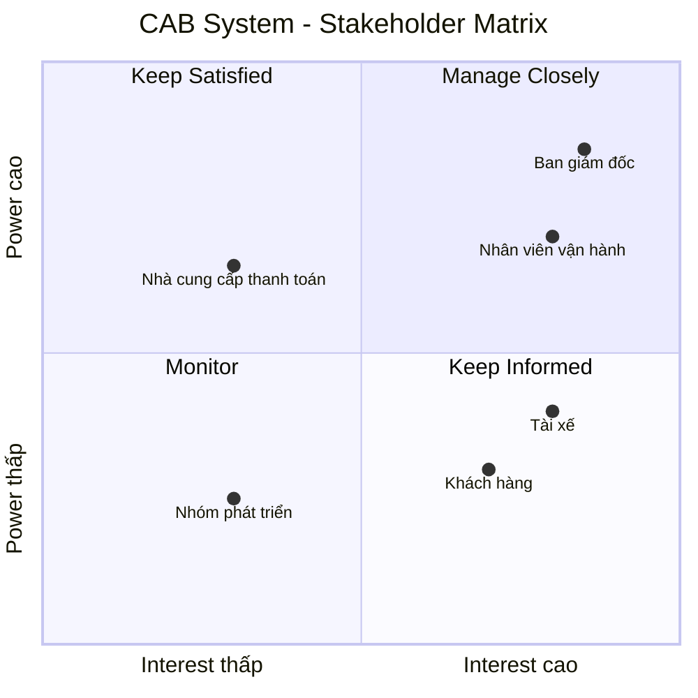

# 23700751_HuynhNhatTruong_CABSYSTEM
| STT | Yếu điểm                                             | Phân tích                                                                                                                                                        |
| --- | ---------------------------------------------------- | ---------------------------------------------------------------------------------------------------------------------------------------------------------------- |
| 1   | **Phân công tài xế chủ yếu thủ công**                | Việc tìm và phân công tài xế chưa được tự động hóa, gây mất thời gian và khó xử lý khi số lượng chuyến tăng.                                                     |
| 2   | **Khách hàng khó theo dõi chuyến đi**                | Khách hàng chưa dễ dàng biết hệ thống đang tìm tài xế, tài xế nào đã nhận chuyến hoặc trạng thái hiện tại của chuyến đi.                                         |
| 3   | **Thông tin thanh toán chưa được quản lý tập trung** | Việc quản lý và tra cứu thông tin thanh toán còn hạn chế.                                                                                                        |
| 4   | **Khó mở rộng hệ thống**                             | Hệ thống hiện tại gặp khó khăn khi doanh nghiệp muốn phục vụ số lượng lớn khách hàng và tài xế.                                                                  |
| 5   | **Quản lý tài xế chưa hiệu quả**                     | Chưa có cơ chế đầy đủ để quản lý trạng thái hoạt động, thông tin phương tiện và vị trí tài xế.                                                                   |
| 6   | **Khó xử lý khi tài xế từ chối hoặc không phản hồi** | Việc tìm tài xế thay thế cần được cải thiện để khách hàng không phải tạo lại yêu cầu.                                                                            |
| 7   | **Hỗ trợ thanh toán còn hạn chế**                    | Doanh nghiệp cần tích hợp với nhà cung cấp thanh toán bên ngoài và xử lý trường hợp giao dịch thất bại.                                                          |
| 8   | **Hệ thống thông báo chưa đáp ứng đầy đủ**           | Cần thông báo cho khách hàng và tài xế ở nhiều trạng thái khác nhau của chuyến đi.                                                                               |
| 9   | **Khó khăn trong công tác vận hành**                 | Nhân viên vận hành cần một giao diện quản trị để quản lý khách hàng, tài xế, phương tiện và chuyến đi.                                                           |
| 10  | **Khả năng mở rộng và thay đổi còn hạn chế**         | Doanh nghiệp muốn bổ sung dịch vụ, phương thức thanh toán, nhà cung cấp thông báo hoặc thay đổi thành phần kỹ thuật mà không phải xây dựng lại toàn bộ hệ thống. |

Tại sao cần hệ thống mới?

Do những hạn chế trên, doanh nghiệp cần xây dựng một CAB System mới nhằm:

Tự động hóa quy trình tìm và phân công tài xế dựa trên vị trí, trạng thái sẵn sàng và các tiêu chí vận hành.

Cho phép khách hàng theo dõi chuyến đi từ lúc tạo yêu cầu cho đến khi hoàn thành.

Quản lý thông tin khách hàng, tài xế, phương tiện và chuyến đi một cách tập trung.

Hỗ trợ tính cước và thanh toán, bao gồm cả tiền mặt và thanh toán điện tử.

Xử lý trường hợp tài xế không phản hồi hoặc từ chối chuyến bằng cách tiếp tục tìm tài xế khác.

Cung cấp hệ thống thông báo cho khách hàng và tài xế trong các trạng thái quan trọng.

Hỗ trợ nhân viên vận hành theo dõi chuyến đang diễn ra, trạng thái tài xế, sự cố và lịch sử giao dịch.

Cung cấp báo cáo cho ban lãnh đạo về số lượng chuyến, doanh thu, tỷ lệ hoàn thành, tỷ lệ hủy và hiệu quả hoạt động của tài xế.

Đảm bảo bảo mật và phân quyền đối với dữ liệu cá nhân, dữ liệu vị trí, dữ liệu giao dịch và các thao tác quản trị.

Có khả năng mở rộng độc lập, hạn chế việc một lỗi ở thanh toán hoặc thông báo làm ảnh hưởng toàn bộ hệ thống.

Dễ dàng phát triển trong tương lai, chẳng hạn như thêm loại dịch vụ, phương thức thanh toán hoặc nhà cung cấp thông báo.

B2. Xác định Stakeholder
| STT | Stakeholder                   | Vai trò / Mối quan tâm                                                                       |
| --- | ----------------------------- | -------------------------------------------------------------------------------------------- |
| 1   | **Khách hàng**                | Đăng ký, đặt xe, theo dõi chuyến, xem lịch sử, thanh toán và đánh giá tài xế.                |
| 2   | **Tài xế**                    | Quản lý hồ sơ, phương tiện, trạng thái hoạt động, nhận chuyến và cập nhật trạng thái chuyến. |
| 3   | **Nhân viên vận hành**        | Quản lý khách hàng, tài xế, phương tiện, chuyến đi và xử lý sự cố.                           |
| 4   | **Ban giám đốc**              | Đưa ra định hướng, theo dõi doanh thu, số lượng chuyến và hiệu quả hoạt động.                |
| 5   | **Bộ phận tài chính/kế toán** | Quan tâm đến doanh thu, thanh toán, giao dịch và dữ liệu tài chính của hệ thống.             |
| 6   | **Nhà cung cấp thanh toán**   | Cung cấp dịch vụ xử lý thanh toán điện tử bên ngoài.                                         |
| 7   | **Business Analyst (BA)**     | Làm rõ các yêu cầu chưa được xác định và xác nhận yêu cầu với các bên liên quan.             |
| 8   | **Nhóm phát triển hệ thống**  | Xây dựng và triển khai hệ thống dựa trên yêu cầu đã được xác nhận.                           |

# Stakeholder Matrix

|                | **Interest thấp** | **Interest cao** |
|----------------|-------------------|------------------|
| **Power cao**  | **Nhà cung cấp thanh toán** Ảnh hưởng đến hoạt động thanh toán nhưng không sử dụng hệ thống CAB trực tiếp. | **Ban giám đốc** Đưa ra định hướng và kỳ vọng đối với hệ thống.  **Nhân viên vận hành** Trực tiếp quản lý và xử lý hoạt động của hệ thống. |
| **Power thấp** | **Nhóm phát triển hệ thống** Xây dựng và triển khai hệ thống theo các yêu cầu đã được xác định. | **Khách hàng** Người sử dụng trực tiếp dịch vụ đặt xe.  **Tài xế** Người sử dụng trực tiếp hệ thống để nhận và thực hiện chuyến. |
## Stakeholder Matrix

#B3
| ID       | Business Goal                                           | Mô tả chi tiết                                                                                                                                                                                                     |
| -------- | ------------------------------------------------------- | ------------------------------------------------------------------------------------------------------------------------------------------------------------------------------------------------------------------ |
| **BG01** | **Tự động hóa quy trình đặt xe và phân công tài xế**    | Tự động xác định tài xế phù hợp dựa trên vị trí, trạng thái sẵn sàng và các tiêu chí vận hành. Khi tài xế không phản hồi hoặc từ chối, hệ thống tiếp tục tìm tài xế khác mà khách hàng không phải tạo lại yêu cầu. |
| **BG02** | **Nâng cao trải nghiệm khách hàng**                     | Cho phép khách hàng đăng ký, đặt xe, theo dõi quá trình tìm tài xế, biết tài xế đã nhận chuyến, thời gian dự kiến đến, trạng thái chuyến, lịch sử chuyến, số tiền phải trả và đánh giá tài xế.                     |
| **BG03** | **Nâng cao hiệu quả quản lý tài xế**                    | Quản lý hồ sơ, phương tiện, trạng thái hoạt động và vị trí tài xế; hỗ trợ tìm tài xế gần khách hàng và cải thiện khả năng dự kiến thời gian đến.                                                                   |
| **BG04** | **Quản lý thanh toán và tính cước hiệu quả**            | Tính số tiền khách hàng phải trả dựa trên loại dịch vụ và thông tin chuyến đi; hỗ trợ tiền mặt và thanh toán điện tử; tích hợp nhà cung cấp thanh toán bên ngoài và xử lý giao dịch thất bại.                      |
| **BG05** | **Cải thiện khả năng quản lý và vận hành doanh nghiệp** | Cung cấp giao diện quản trị để nhân viên quản lý khách hàng, tài xế, phương tiện, chuyến đi, theo dõi chuyến đang diễn ra, xử lý chuyến lỗi và tra cứu lịch sử giao dịch.                                          |
| **BG06** | **Cung cấp dữ liệu và báo cáo cho ban lãnh đạo**        | Cung cấp báo cáo về số lượng chuyến, doanh thu, tỷ lệ chuyến hoàn thành, tỷ lệ hủy và hiệu quả hoạt động của tài xế để hỗ trợ theo dõi hoạt động.                                                                  |
| **BG07** | **Đảm bảo tính ổn định và khả năng mở rộng**            | Hệ thống phải hoạt động ổn định khi nhu cầu tăng cao; lỗi ở thanh toán hoặc thông báo không được làm toàn bộ hệ thống đặt xe ngừng hoạt động; các thành phần có thể mở rộng độc lập khi tải tăng.                  |
| **BG08** | **Đảm bảo an toàn và bảo mật dữ liệu**                  | Xác thực khách hàng và tài xế, kiểm soát quyền truy cập các chức năng quản trị, bảo vệ thông tin cá nhân, phương tiện, vị trí và giao dịch, đồng thời lưu vết các thao tác quan trọng.                             |
| **BG09** | **Tạo nền tảng có khả năng phát triển lâu dài**         | Cho phép bổ sung loại dịch vụ mới, phương thức thanh toán mới, nhà cung cấp thông báo mới hoặc thay đổi thành phần kỹ thuật mà không phải xây dựng lại toàn bộ ứng dụng.                                           |
| **BG10** | **Hỗ trợ phối hợp giữa các bộ phận**                    | Cho phép các bộ phận trong doanh nghiệp phối hợp thông qua hệ thống và có đủ dữ liệu để theo dõi hoạt động.|                                                      

#B4
| STT   | Chức năng cốt lõi                | Nội dung chính                                                                                                  |
| ----- | -------------------------------- | --------------------------------------------------------------------------------------------------------------- |
| **1** | **Quản lý tài khoản**            | Đăng ký, đăng nhập, cập nhật thông tin khách hàng và tài xế.                                                    |
| **2** | **Đặt xe**                       | Khách hàng nhập điểm đón, điểm đến, chọn loại xe và gửi yêu cầu đặt xe.                                         |
| **3** | **Quản lý tài xế**              | Hệ thống tìm tài xế phù hợp dựa trên vị trí,tài xế nhận hoặc hủy, trạng thái sẵn sàng; xử lý khi tài xế từ chối hoặc không phản hồi. |
| **4** | **Quản lý & theo dõi chuyến đi** | Tài xế cập nhật trạng thái chuyến; khách hàng theo dõi tài xế và trạng thái chuyến đi.                          |
| **5** | **Tính cước & thanh toán**       | Tính số tiền phải trả, hỗ trợ tiền mặt và thanh toán điện tử thông qua nhà cung cấp bên ngoài.                  |
| **6** | **Thông báo**                    | Thông báo cho khách hàng và tài xế về các sự kiện quan trọng của chuyến đi và thanh toán.                       |
| **7** | **Quản lý sau chuyến đi**        | Lưu lịch sử chuyến, hiển thị số tiền phải trả và cho phép khách hàng đánh giá tài xế.                           |

#B5
| **ID**    | **Nhóm nghiệp vụ**               | **Business Requirement**                                                                               | **Chi tiết yêu cầu**                                                                                                                                                                                                                                                                           |
| --------- | -------------------------------- | ------------------------------------------------------------------------------------------------------ | ---------------------------------------------------------------------------------------------------------------------------------------------------------------------------------------------------------------------------------------------------------------------------------------------- |
| **BR-01** | **Quản lý tài khoản**            | Hệ thống phải hỗ trợ quản lý tài khoản khách hàng và tài xế.                                           | Cho phép khách hàng đăng ký, đăng nhập và cập nhật thông tin cá nhân. Tài xế có thể đăng ký hoặc được nhân viên vận hành tạo tài khoản, sau đó cập nhật hồ sơ cá nhân và thông tin phương tiện. Các chức năng yêu cầu tài khoản phải được xác thực trước khi sử dụng.                          |
| **BR-02** | **Đặt xe**                       | Hệ thống phải cho phép khách hàng tạo yêu cầu đặt xe.                                                  | Khách hàng nhập điểm đón, điểm đến, lựa chọn loại xe/dịch vụ và gửi yêu cầu đặt xe. Hệ thống phải tiếp nhận và xử lý yêu cầu mà khách hàng không cần liên hệ thủ công với nhân viên.                                                                                                           |
| **BR-03** | **Tìm kiếm & phân công tài xế**  | Hệ thống phải tự động tìm và đề xuất tài xế phù hợp cho yêu cầu đặt xe.                                | Việc lựa chọn tài xế dựa trên vị trí, trạng thái sẵn sàng và các tiêu chí vận hành khác. Hệ thống ưu tiên tài xế phù hợp và gần khách hàng. Nếu tài xế không phản hồi hoặc từ chối, hệ thống phải tiếp tục tìm tài xế khác mà không yêu cầu khách hàng tạo lại yêu cầu.                        |
| **BR-04** | **Quản lý tài xế**               | Hệ thống phải hỗ trợ quản lý trạng thái, hồ sơ, phương tiện và vị trí của tài xế.                      | Tài xế có thể chuyển sang trạng thái sẵn sàng nhận chuyến khi làm việc, cập nhật hồ sơ và phương tiện. Hệ thống lưu thông tin vị trí để hỗ trợ tìm tài xế gần khách hàng và cải thiện thời gian dự kiến tài xế đến.                                                                            |
| **BR-05** | **Quản lý & theo dõi chuyến đi** | Hệ thống phải quản lý toàn bộ trạng thái của chuyến từ khi được nhận đến khi hoàn thành.               | Tài xế có thể nhận/từ chối chuyến và cập nhật các trạng thái **đã đến điểm đón, đã đón khách, đang di chuyển và hoàn thành chuyến**. Khách hàng có thể biết tài xế đã nhận chuyến, thời gian dự kiến đến và trạng thái hiện tại của chuyến.                                                    |
| **BR-06** | **Tính cước**                    | Hệ thống phải xác định số tiền khách hàng cần thanh toán sau khi chuyến hoàn thành.                    | Số tiền phải trả được xác định dựa trên loại dịch vụ và thông tin chuyến đi. **Công thức và quy tắc tính cước cụ thể chưa được doanh nghiệp chốt và cần BA xác nhận với stakeholder.**                                                                                                         |
| **BR-07** | **Thanh toán**                   | Hệ thống phải hỗ trợ nhiều phương thức thanh toán và tích hợp với nhà cung cấp thanh toán bên ngoài.   | Hỗ trợ thanh toán tiền mặt và thanh toán điện tử. Thông tin nhạy cảm của thẻ/tài khoản không được lưu trực tiếp trong CAB. Khi thanh toán điện tử thất bại, hệ thống phải thông báo và cho phép xử lý lại theo chính sách doanh nghiệp.                                                        |
| **BR-08** | **Thông báo**                    | Hệ thống phải cung cấp cơ chế thông báo cho khách hàng và tài xế trong suốt quá trình sử dụng dịch vụ. | Khách hàng nhận thông báo khi yêu cầu được tiếp nhận, tài xế nhận chuyến, tài xế đến điểm đón, chuyến hoàn thành và thanh toán có kết quả. Tài xế nhận thông báo về chuyến mới và các thay đổi liên quan đến chuyến đang thực hiện.                                                            |
| **BR-09** | **Lịch sử & đánh giá**           | Hệ thống phải hỗ trợ quản lý thông tin sau khi chuyến đi hoàn thành.                                   | Khách hàng có thể xem lịch sử chuyến đi, số tiền phải trả và đánh giá tài xế sau chuyến. Nhân viên vận hành có thể tra cứu lịch sử giao dịch để phục vụ quản lý.                                                                                                                               |
| **BR-10** | **Quản lý vận hành**             | Hệ thống phải cung cấp giao diện quản trị phục vụ hoạt động vận hành doanh nghiệp.                     | Nhân viên vận hành có thể quản lý khách hàng, tài xế, phương tiện và chuyến đi; xem các chuyến đang diễn ra, kiểm tra trạng thái tài xế, hỗ trợ xử lý chuyến bị lỗi và tra cứu lịch sử giao dịch.                                                                                              |
| **BR-11** | **Phân quyền & bảo mật**         | Hệ thống phải kiểm soát quyền truy cập và bảo vệ dữ liệu nghiệp vụ.                                    | Các thao tác quản trị phải được phân quyền; nhân viên thông thường không được thực hiện các thao tác nhạy cảm. Hệ thống phải bảo vệ thông tin cá nhân, thông tin phương tiện, dữ liệu vị trí và dữ liệu giao dịch; đồng thời lưu vết các thao tác quan trọng để phục vụ kiểm tra khi có sự cố. |
| **BR-12** | **Báo cáo quản trị**             | Hệ thống phải cung cấp dữ liệu và báo cáo phục vụ quản lý doanh nghiệp.                                | Ban lãnh đạo cần theo dõi **số lượng chuyến, doanh thu, tỷ lệ chuyến hoàn thành, tỷ lệ hủy và hiệu quả hoạt động của tài xế**.                                                                                                                                                                 |
| **BR-13** | **Khả năng mở rộng & ổn định**   | Hệ thống phải có khả năng hoạt động ổn định khi nhu cầu tăng và cho phép mở rộng từng thành phần.      | Các thành phần phải có khả năng mở rộng độc lập khi tải tăng. Lỗi ở chức năng thanh toán hoặc thông báo không được làm toàn bộ hệ thống đặt xe ngừng hoạt động. Các chức năng mới có thể được triển khai từng phần với ảnh hưởng hạn chế đến các chức năng đang hoạt động.                     |
| **BR-14** | **Khả năng phát triển lâu dài**  | Hệ thống phải có kiến trúc đủ linh hoạt để đáp ứng nhu cầu phát triển trong tương lai.                 | Cho phép bổ sung loại dịch vụ mới, phương thức thanh toán mới, nhà cung cấp thông báo mới hoặc thay đổi một số thành phần kỹ thuật mà không phải xây dựng lại toàn bộ ứng dụng.                                                                                                                |
