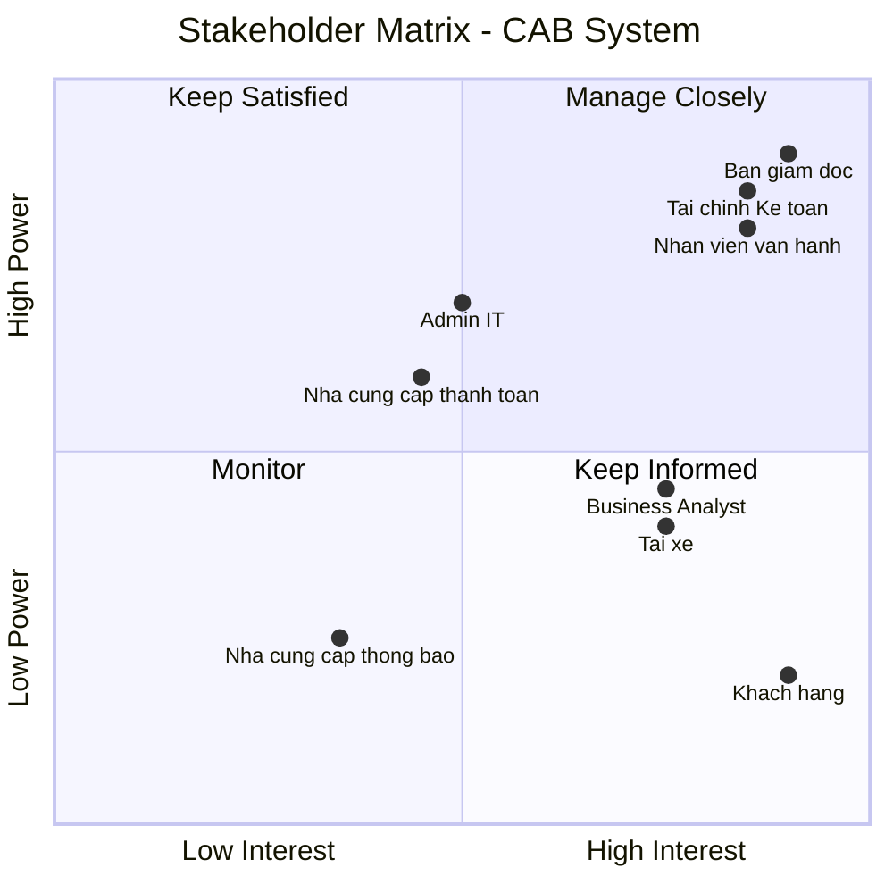

# 23700751_HuynhNhatTruong_CABSYSTEM
# Giai đoạn 1
| STT | Yếu điểm                                             | Phân tích                                                                                                                                                        |
| --- | ---------------------------------------------------- | ---------------------------------------------------------------------------------------------------------------------------------------------------------------- |
| 1   | **Phân công tài xế chủ yếu thủ công**                | Việc tìm và phân công tài xế chưa được tự động hóa, gây mất thời gian và khó xử lý khi số lượng chuyến tăng.                                                     |
| 2   | **Khách hàng khó theo dõi chuyến đi**                | Khách hàng chưa dễ dàng biết hệ thống đang tìm tài xế, tài xế nào đã nhận chuyến hoặc trạng thái hiện tại của chuyến đi.                                         |
| 3   | **Thông tin thanh toán chưa được quản lý tập trung** | Việc quản lý và tra cứu thông tin thanh toán còn hạn chế.                                                                                                        |
| 4   | **Khó mở rộng hệ thống**                             | Hệ thống hiện tại gặp khó khăn khi doanh nghiệp muốn phục vụ số lượng lớn khách hàng và tài xế.                                                                  |
| 5   | **Quản lý tài xế chưa hiệu quả**                     | Chưa có cơ chế đầy đủ để quản lý trạng thái hoạt động, thông tin phương tiện và vị trí tài xế.                                                                   |
| 6   | **Khó xử lý khi tài xế từ chối hoặc không phản hồi** | Việc tìm tài xế thay thế cần được cải thiện để khách hàng không phải tạo lại yêu cầu.                                                                            |
| 7   | **Hỗ trợ thanh toán còn hạn chế**                    | Doanh nghiệp cần tích hợp với nhà cung cấp thanh toán bên ngoài và xử lý trường hợp giao dịch thất bại.                                                          |
| 8   | **Hệ thống thông báo chưa đáp ứng đầy đủ**           | Cần thông báo cho khách hàng và tài xế ở nhiều trạng thái khác nhau của chuyến đi.                                                                               |
| 9   | **Khó khăn trong công tác vận hành**                 | Nhân viên vận hành cần một giao diện quản trị để quản lý khách hàng, tài xế, phương tiện và chuyến đi.                                                           |
| 10  | **Khả năng mở rộng và thay đổi còn hạn chế**         | Doanh nghiệp muốn bổ sung dịch vụ, phương thức thanh toán, nhà cung cấp thông báo hoặc thay đổi thành phần kỹ thuật mà không phải xây dựng lại toàn bộ hệ thống. |

**Tại sao cần hệ thống mới?**

Do những hạn chế trên, doanh nghiệp cần xây dựng một CAB System mới nhằm:

Tự động hóa quy trình tìm và phân công tài xế dựa trên vị trí, trạng thái sẵn sàng và các tiêu chí vận hành.

Cho phép khách hàng theo dõi chuyến đi từ lúc tạo yêu cầu cho đến khi hoàn thành.

Quản lý thông tin khách hàng, tài xế, phương tiện và chuyến đi một cách tập trung.

Hỗ trợ tính cước và thanh toán, bao gồm cả tiền mặt và thanh toán điện tử.

Xử lý trường hợp tài xế không phản hồi hoặc từ chối chuyến bằng cách tiếp tục tìm tài xế khác.

Cung cấp hệ thống thông báo cho khách hàng và tài xế trong các trạng thái quan trọng.

Hỗ trợ nhân viên vận hành theo dõi chuyến đang diễn ra, trạng thái tài xế, sự cố và lịch sử giao dịch.

Cung cấp báo cáo cho ban lãnh đạo về số lượng chuyến, doanh thu, tỷ lệ hoàn thành, tỷ lệ hủy và hiệu quả hoạt động của tài xế.

Đảm bảo bảo mật và phân quyền đối với dữ liệu cá nhân, dữ liệu vị trí, dữ liệu giao dịch và các thao tác quản trị.

Có khả năng mở rộng độc lập, hạn chế việc một lỗi ở thanh toán hoặc thông báo làm ảnh hưởng toàn bộ hệ thống.

Dễ dàng phát triển trong tương lai, chẳng hạn như thêm loại dịch vụ, phương thức thanh toán hoặc nhà cung cấp thông báo.

# Giai đoạn 2 Xác định Stakeholder
| **STT** | **Stakeholder**                    | **Vai trò / Mối quan tâm**                                                                                 |
| ------: | ---------------------------------- | ---------------------------------------------------------------------------------------------------------- |
|       1 | **Khách hàng**                     | Đăng ký, đặt xe, theo dõi chuyến, xem lịch sử, thanh toán và đánh giá tài xế.                              |
|       2 | **Tài xế**                         | Quản lý hồ sơ, phương tiện, trạng thái hoạt động, nhận chuyến và cập nhật trạng thái chuyến.               |
|       3 | **Nhân viên vận hành**             | Quản lý khách hàng, tài xế, phương tiện, chuyến đi và xử lý các trường hợp phát sinh.                      |
|       4 | **Ban giám đốc**                   | Đưa ra định hướng, theo dõi doanh thu, số lượng chuyến, tỷ lệ hoàn thành và hiệu quả hoạt động.            |
|       5 | **Bộ phận Tài chính**              | Quản lý doanh thu, thanh toán, giao dịch, đối soát và dữ liệu tài chính của hệ thống.                      |
|       6 | **Quản trị hệ thống**              | Quản lý tài khoản, phân quyền, bảo mật và đảm bảo hệ thống hoạt động ổn định.                              |
|       7 | **Nhà cung cấp thanh toán**        | Cung cấp dịch vụ xử lý thanh toán điện tử bên ngoài và trả kết quả giao dịch cho hệ thống.                 |
|       8 | **Nhà cung cấp dịch vụ thông báo** | Cung cấp dịch vụ gửi thông báo đến khách hàng và tài xế thông qua các kênh được tích hợp.                  |
|       9 | **Business Analyst (BA)**          | Thu thập, phân tích, làm rõ các yêu cầu chưa xác định và xác nhận yêu cầu với các bên liên quan.           |

# Stakeholder Matrix
|                | **Interest thấp**                                                                                                                                                                                                                    | **Interest cao**                                                                                                                                                                                                                                                                                                  |
| -------------- | ------------------------------------------------------------------------------------------------------------------------------------------------------------------------------------------------------------------------------------ | ----------------------------------------------------------------------------------------------------------------------------------------------------------------------------------------------------------------------------------------------------------------------------------------------------------------- |
| **Power cao**  | **Nhà cung cấp thanh toán** Ảnh hưởng đến hoạt động thanh toán nhưng không sử dụng hệ thống CAB trực tiếp.  **Admin/IT** Quản lý hệ thống, bảo mật và quyền truy cập nhưng không trực tiếp sử dụng các nghiệp vụ đặt xe. | **Ban giám đốc** Đưa ra định hướng, mục tiêu và kỳ vọng đối với hệ thống.  **Nhân viên vận hành** Trực tiếp quản lý, theo dõi và xử lý các hoạt động của hệ thống.  **Bộ phận Tài chính/Kế toán** Quản lý thanh toán, doanh thu, giao dịch và đối soát.                                      |
| **Power thấp** | **Nhà cung cấp dịch vụ thông báo** Cung cấp dịch vụ gửi thông báo nhưng không trực tiếp tham gia vào hoạt động nghiệp vụ của hệ thống.                                                                                            | **Khách hàng** Người sử dụng trực tiếp dịch vụ để đặt xe, theo dõi chuyến, thanh toán và đánh giá tài xế.  **Tài xế** Người sử dụng hệ thống để nhận chuyến, cập nhật trạng thái và thực hiện chuyến.  **Business Analyst (BA)** Thu thập, phân tích và làm rõ yêu cầu từ các bên liên quan. |

## Stakeholder Matrix

# Giai đoạn 3
| **ID** | **Business Goal**                                       | **Mô tả chi tiết**                                                                                                                                                                                                 |
| -----: | ------------------------------------------------------- | ------------------------------------------------------------------------------------------------------------------------------------------------------------------------------------------------------------------ |
|  **1** | **Tự động hóa quy trình đặt xe và phân công tài xế**    | Tự động xác định tài xế phù hợp dựa trên vị trí, trạng thái sẵn sàng và các tiêu chí vận hành. Khi tài xế không phản hồi hoặc từ chối, hệ thống tiếp tục tìm tài xế khác mà khách hàng không phải tạo lại yêu cầu. |
|  **2** | **Nâng cao trải nghiệm khách hàng**                     | Cho phép khách hàng đăng ký, đặt xe, theo dõi quá trình tìm tài xế, biết tài xế đã nhận chuyến, thời gian dự kiến đến, trạng thái chuyến, lịch sử chuyến, số tiền phải trả và đánh giá tài xế.                     |
|  **3** | **Nâng cao hiệu quả quản lý tài xế**                    | Quản lý hồ sơ, phương tiện, trạng thái hoạt động và vị trí tài xế; hỗ trợ tìm tài xế gần khách hàng và cải thiện khả năng dự kiến thời gian đến.                                                                   |
|  **4** | **Quản lý thanh toán và tính cước hiệu quả**            | Tính số tiền khách hàng phải trả dựa trên loại dịch vụ và thông tin chuyến đi; hỗ trợ thanh toán tiền mặt và thanh toán điện tử; tích hợp nhà cung cấp thanh toán bên ngoài và xử lý giao dịch thất bại.           |
|  **5** | **Cải thiện khả năng quản lý và vận hành doanh nghiệp** | Cung cấp giao diện quản trị để nhân viên quản lý khách hàng, tài xế, phương tiện, chuyến đi, theo dõi chuyến đang diễn ra, xử lý chuyến lỗi và tra cứu lịch sử giao dịch.                                          |
|  **6** | **Cung cấp dữ liệu và báo cáo cho ban lãnh đạo**        | Cung cấp báo cáo về số lượng chuyến, doanh thu, tỷ lệ chuyến hoàn thành, tỷ lệ hủy và hiệu quả hoạt động của tài xế để hỗ trợ theo dõi và ra quyết định.                                                           |
|  **7** | **Đảm bảo tính ổn định và khả năng mở rộng**            | Hệ thống phải hoạt động ổn định khi nhu cầu tăng cao; lỗi ở thanh toán hoặc thông báo không được làm toàn bộ hệ thống đặt xe ngừng hoạt động; các thành phần có thể mở rộng độc lập khi tải tăng.                  |
|  **8** | **Đảm bảo an toàn và bảo mật dữ liệu**                  | Xác thực khách hàng và tài xế, kiểm soát quyền truy cập các chức năng quản trị, bảo vệ thông tin cá nhân, phương tiện, vị trí và giao dịch, đồng thời lưu vết các thao tác quan trọng.                             |
|  **9** | **Tạo nền tảng có khả năng phát triển lâu dài**         | Cho phép bổ sung loại dịch vụ mới, phương thức thanh toán mới, nhà cung cấp thông báo mới hoặc thay đổi thành phần kỹ thuật mà không phải xây dựng lại toàn bộ ứng dụng.                                           |
| **10** | **Hỗ trợ phối hợp giữa các bộ phận**                    | Cho phép các bộ phận trong doanh nghiệp phối hợp thông qua hệ thống và có đủ dữ liệu để theo dõi hoạt động.                                                                                                        |
                                                      

# Giai đoạn 4
| **STT** | **Phạm vi**                 | **Nội dung thực hiện**                                                    |
| ------: | --------------------------- | ------------------------------------------------------------------------- |
|   **1** | **Quản lý tài khoản**       | Đăng ký, đăng nhập, đăng xuất và cập nhật thông tin người dùng.           |
|   **2** | **Quản lý khách hàng**      | Quản lý thông tin khách hàng và lịch sử chuyến đi.                        |
|   **3** | **Quản lý tài xế**          | Quản lý hồ sơ, phương tiện, trạng thái hoạt động và vị trí tài xế.        |
|   **4** | **Đặt xe**                  | Nhập điểm đón, điểm đến, chọn loại xe và gửi yêu cầu đặt xe.              |
|   **5** | **Tìm tài xế**              | Tự động tìm và phân công tài xế phù hợp với yêu cầu.                      |
|   **6** | **Quản lý chuyến đi**       | Nhận chuyến, đến điểm đón, đón khách, di chuyển và hoàn thành chuyến.     |
|   **7** | **Theo dõi chuyến**         | Cho phép khách hàng theo dõi tài xế và trạng thái chuyến đi.              |
|   **8** | **Tính cước và thanh toán** | Tính cước, hỗ trợ tiền mặt và thanh toán trực tuyến.                      |
|   **9** | **Thông báo**               | Gửi thông báo về đặt xe, tài xế, trạng thái chuyến và thanh toán.         |
|  **10** | **Đánh giá**                | Cho phép khách hàng đánh giá tài xế sau khi hoàn thành chuyến.            |
|  **11** | **Quản lý vận hành**        | Theo dõi khách hàng, tài xế, chuyến đi và xử lý các trường hợp phát sinh. |
|  **12** | **Quản lý tài chính**       | Theo dõi giao dịch, doanh thu và hỗ trợ đối soát.                         |

# Giai đoạn 5
| **ID** | **Business Requirement**      | **Mô tả chi tiết**                                                                                                                                                  |
| -----: | ----------------------------- | ------------------------------------------------------------------------------------------------------------------------------------------------------------------- |
|  **BR-01** | **Quản lý tài khoản**         | Hệ thống cho phép khách hàng, tài xế và nhân viên đăng nhập để sử dụng các chức năng phù hợp với vai trò.                                                           |
|  **BR-02** | **Quản lý khách hàng**        | Hệ thống cho phép quản lý thông tin khách hàng, trạng thái tài khoản và lịch sử chuyến đi.                                                                          |
|  **BR-03** | **Quản lý tài xế**            | Hệ thống cho phép quản lý hồ sơ tài xế, phương tiện, trạng thái hoạt động và vị trí tài xế.                                                                         |
|  **BR-04** | **Đặt xe**                    | Hệ thống cho phép khách hàng nhập điểm đón, điểm đến, lựa chọn loại xe và gửi yêu cầu đặt xe.                                                                       |
|  **BR-05** | **Tự động tìm tài xế**        | Hệ thống tự động tìm tài xế phù hợp dựa trên vị trí, trạng thái sẵn sàng, loại xe và các tiêu chí vận hành.                                                         |
|  **BR-06** | **Xử lý nhận chuyến**         | Hệ thống cho phép tài xế nhận hoặc từ chối yêu cầu chuyến. Khi tài xế từ chối hoặc không phản hồi, hệ thống tiếp tục tìm tài xế khác.                               |
|  **BR-07** | **Theo dõi chuyến đi**        | Hệ thống cho phép khách hàng theo dõi tài xế, thời gian dự kiến đến và trạng thái chuyến trong quá trình thực hiện.                                                 |
|  **BR-08** | **Quản lý trạng thái chuyến** | Hệ thống hỗ trợ cập nhật trạng thái từ khi tìm tài xế, nhận chuyến, đến điểm đón, đón khách, di chuyển đến khi hoàn thành.                                          |
|  **BR-09** | **Tính cước**                 | Hệ thống xác định số tiền khách hàng phải trả dựa trên loại dịch vụ và thông tin chuyến đi.                                                                         |
| **BR-010** | **Thanh toán**                | Hệ thống cho phép khách hàng thanh toán bằng tiền mặt hoặc phương thức thanh toán điện tử thông qua nhà cung cấp bên ngoài.                                         |
| **BR-011** | **Quản lý giao dịch**         | Hệ thống ghi nhận trạng thái giao dịch và xử lý các trường hợp thanh toán thành công hoặc thất bại.                                                                 |
| **BR-012** | **Thông báo**                 | Hệ thống gửi thông báo cho khách hàng và tài xế khi có các sự kiện quan trọng liên quan đến đặt xe, chuyến đi và thanh toán.                                        |
| **BR-013** | **Đánh giá tài xế**           | Hệ thống cho phép khách hàng đánh giá tài xế sau khi chuyến đi hoàn thành.                                                                                          |
| **BR-014** | **Quản lý vận hành**          | Hệ thống cho phép nhân viên vận hành quản lý khách hàng, tài xế, phương tiện, chuyến đi và xử lý các trường hợp phát sinh.                                          |
| **BR-015** | **Quản lý tài chính**         | Hệ thống hỗ trợ bộ phận Tài chính/Kế toán tra cứu giao dịch, theo dõi doanh thu và đối soát thanh toán.                                                             |
| **BR-016** | **Báo cáo hoạt động**         | Hệ thống cung cấp dữ liệu về số lượng chuyến, doanh thu, tỷ lệ hoàn thành, tỷ lệ hủy và hiệu quả hoạt động của tài xế.  
                                              
# Giai đoạn 6
Functional Requirements – CAB System
| **ID**       | **Business Requirement**  | **Functional Requirement**       | **Mô tả chức năng**                                                                                        |
| ------------ | ------------------------- | -------------------------------- | ---------------------------------------------------------------------------------------------------------- |
| **FR-01.01** | BR-01 – Quản lý tài khoản | **Đăng ký tài khoản khách hàng** | Hệ thống phải cho phép khách hàng tạo tài khoản mới bằng cách cung cấp các thông tin cần thiết.            |
| **FR-01.02** | BR-01 – Quản lý tài khoản | **Đăng nhập**                    | Hệ thống phải cho phép khách hàng, tài xế và nhân viên đăng nhập bằng tài khoản đã được cấp hoặc đăng ký.  |
| **FR-01.03** | BR-01 – Quản lý tài khoản | **Đăng xuất**                    | Hệ thống phải cho phép người dùng đăng xuất khỏi tài khoản sau khi sử dụng hệ thống.                       |
| **FR-01.04** | BR-01 – Quản lý tài khoản | **Cập nhật thông tin cá nhân**   | Hệ thống phải cho phép người dùng cập nhật thông tin cá nhân của mình.                                     |
| **FR-01.05** | BR-01 – Quản lý tài khoản | **Quản lý tài khoản tài xế**     | Hệ thống phải cho phép tài xế đăng ký hoặc được nhân viên vận hành tạo tài khoản và cập nhật hồ sơ tài xế. |
| **FR-01.06** | BR-01 – Quản lý tài khoản | **Xác thực người dùng**          | Hệ thống phải xác thực người dùng trước khi cho phép sử dụng các chức năng yêu cầu tài khoản.              |
| **FR-01.07** | BR-01 – Quản lý tài khoản | **Phân quyền người dùng**        | Hệ thống phải phân quyền chức năng dựa trên vai trò của khách hàng, tài xế và nhân viên.                   |

| **ID**       | **Business Requirement**   | **Functional Requirement**        | **Mô tả chức năng**                                                                              |
| ------------ | -------------------------- | --------------------------------- | ------------------------------------------------------------------------------------------------ |
| **FR-02.01** | BR-02 – Quản lý khách hàng | **Xem danh sách khách hàng**      | Hệ thống phải cho phép nhân viên vận hành xem danh sách khách hàng.                              |
| **FR-02.02** | BR-02 – Quản lý khách hàng | **Xem thông tin khách hàng**      | Hệ thống phải cho phép nhân viên vận hành xem thông tin chi tiết của khách hàng.                 |
| **FR-02.03** | BR-02 – Quản lý khách hàng | **Cập nhật thông tin khách hàng** | Hệ thống phải cho phép cập nhật thông tin khách hàng khi cần thiết.                              |
| **FR-02.04** | BR-02 – Quản lý khách hàng | **Quản lý trạng thái tài khoản**  | Hệ thống phải cho phép nhân viên vận hành quản lý trạng thái hoạt động của tài khoản khách hàng. |
| **FR-02.05** | BR-02 – Quản lý khách hàng | **Xem lịch sử chuyến đi**         | Hệ thống phải cho phép xem lịch sử các chuyến đi của khách hàng.                                 |

| **ID**       | **Business Requirement** | **Functional Requirement**        | **Mô tả chức năng**                                                                            |
| ------------ | ------------------------ | --------------------------------- | ---------------------------------------------------------------------------------------------- |
| **FR-03.01** | BR-03 – Quản lý tài xế   | **Quản lý hồ sơ tài xế**          | Hệ thống phải cho phép tài xế và nhân viên vận hành quản lý thông tin hồ sơ tài xế.            |
| **FR-03.02** | BR-03 – Quản lý tài xế   | **Quản lý phương tiện**           | Hệ thống phải cho phép tài xế cập nhật thông tin phương tiện được sử dụng để thực hiện chuyến. |
| **FR-03.03** | BR-03 – Quản lý tài xế   | **Cập nhật trạng thái hoạt động** | Hệ thống phải cho phép tài xế chuyển đổi trạng thái sẵn sàng hoặc không sẵn sàng nhận chuyến.  |
| **FR-03.04** | BR-03 – Quản lý tài xế   | **Cập nhật vị trí tài xế**        | Hệ thống phải ghi nhận vị trí hiện tại của tài xế để phục vụ việc tìm tài xế phù hợp.          |
| **FR-03.05** | BR-03 – Quản lý tài xế   | **Xem thông tin tài xế**          | Hệ thống phải cho phép nhân viên vận hành xem thông tin và trạng thái hoạt động của tài xế.    |

| **ID**       | **Business Requirement** | **Functional Requirement** | **Mô tả chức năng**                                                                    |
| ------------ | ------------------------ | -------------------------- | -------------------------------------------------------------------------------------- |
| **FR-04.01** | BR-04 – Đặt xe           | **Nhập điểm đón**          | Hệ thống phải cho phép khách hàng nhập hoặc lựa chọn vị trí đón.                       |
| **FR-04.02** | BR-04 – Đặt xe           | **Nhập điểm đến**          | Hệ thống phải cho phép khách hàng nhập hoặc lựa chọn điểm đến.                         |
| **FR-04.03** | BR-04 – Đặt xe           | **Chọn loại xe**           | Hệ thống phải cho phép khách hàng lựa chọn loại xe phù hợp với nhu cầu.                |
| **FR-04.04** | BR-04 – Đặt xe           | **Tạo yêu cầu đặt xe**     | Hệ thống phải cho phép khách hàng xác nhận và gửi yêu cầu đặt xe.                      |
| **FR-04.05** | BR-04 – Đặt xe           | **Tạo mã chuyến**          | Hệ thống phải tự động tạo mã định danh cho mỗi chuyến được đặt.                        |
| **FR-04.06** | BR-04 – Đặt xe           | **Hủy yêu cầu đặt xe**     | Hệ thống phải cho phép khách hàng hủy yêu cầu đặt xe theo chính sách của doanh nghiệp. |

| **ID**       | **Business Requirement**   | **Functional Requirement**          | **Mô tả chức năng**                                                                         |
| ------------ | -------------------------- | ----------------------------------- | ------------------------------------------------------------------------------------------- |
| **FR-05.01** | BR-05 – Tự động tìm tài xế | **Xác định tài xế sẵn sàng**        | Hệ thống phải xác định các tài xế đang ở trạng thái sẵn sàng nhận chuyến.                   |
| **FR-05.02** | BR-05 – Tự động tìm tài xế | **Lọc tài xế phù hợp**              | Hệ thống phải lọc tài xế dựa trên loại xe và các tiêu chí phù hợp với yêu cầu đặt xe.       |
| **FR-05.03** | BR-05 – Tự động tìm tài xế | **Xác định khoảng cách**            | Hệ thống phải xác định khoảng cách giữa tài xế và vị trí đón khách.                         |
| **FR-05.04** | BR-05 – Tự động tìm tài xế | **Ưu tiên tài xế gần**              | Hệ thống phải ưu tiên tài xế phù hợp và có vị trí gần khách hàng.                           |
| **FR-05.05** | BR-05 – Tự động tìm tài xế | **Gửi yêu cầu chuyến**              | Hệ thống phải gửi yêu cầu chuyến đến tài xế được lựa chọn.                                  |
| **FR-05.06** | BR-05 – Tự động tìm tài xế | **Tìm tài xế tiếp theo**            | Hệ thống phải tiếp tục tìm tài xế khác nếu tài xế được đề xuất từ chối hoặc không phản hồi. |
| **FR-05.07** | BR-05 – Tự động tìm tài xế | **Thông báo không tìm được tài xế** | Hệ thống phải thông báo cho khách hàng khi không tìm được tài xế phù hợp.                   |

| **ID**       | **Business Requirement**  | **Functional Requirement**    | **Mô tả chức năng**                                                                      |
| ------------ | ------------------------- | ----------------------------- | ---------------------------------------------------------------------------------------- |
| **FR-06.01** | BR-06 – Xử lý nhận chuyến | **Nhận thông báo chuyến mới** | Hệ thống phải thông báo cho tài xế khi có yêu cầu chuyến phù hợp.                        |
| **FR-06.02** | BR-06 – Xử lý nhận chuyến | **Xem thông tin chuyến**      | Hệ thống phải cho phép tài xế xem các thông tin cần thiết của chuyến trước khi phản hồi. |
| **FR-06.03** | BR-06 – Xử lý nhận chuyến | **Chấp nhận chuyến**          | Hệ thống phải cho phép tài xế chấp nhận yêu cầu chuyến.                                  |
| **FR-06.04** | BR-06 – Xử lý nhận chuyến | **Từ chối chuyến**            | Hệ thống phải cho phép tài xế từ chối yêu cầu chuyến.                                    |
| **FR-06.05** | BR-06 – Xử lý nhận chuyến | **Ghi nhận phản hồi**         | Hệ thống phải ghi nhận kết quả và thời gian phản hồi của tài xế.                         |

| **ID**       | **Business Requirement**   | **Functional Requirement**    | **Mô tả chức năng**                                                      |
| ------------ | -------------------------- | ----------------------------- | ------------------------------------------------------------------------ |
| **FR-07.01** | BR-07 – Theo dõi chuyến đi | **Xem thông tin tài xế**      | Hệ thống phải cho phép khách hàng xem thông tin tài xế đã nhận chuyến.   |
| **FR-07.02** | BR-07 – Theo dõi chuyến đi | **Xem thông tin phương tiện** | Hệ thống phải cho phép khách hàng xem thông tin phương tiện của tài xế.  |
| **FR-07.03** | BR-07 – Theo dõi chuyến đi | **Theo dõi vị trí tài xế**    | Hệ thống phải cho phép khách hàng theo dõi vị trí hiện tại của tài xế.   |
| **FR-07.04** | BR-07 – Theo dõi chuyến đi | **Xem thời gian dự kiến**     | Hệ thống phải cung cấp thời gian dự kiến tài xế đến điểm đón.            |
| **FR-07.05** | BR-07 – Theo dõi chuyến đi | **Xem trạng thái chuyến**     | Hệ thống phải cho phép khách hàng xem trạng thái hiện tại của chuyến đi. |

| **ID**       | **Business Requirement**          | **Functional Requirement**             | **Mô tả chức năng**                                                    |
| ------------ | --------------------------------- | -------------------------------------- | ---------------------------------------------------------------------- |
| **FR-08.01** | BR-08 – Quản lý trạng thái chuyến | **Cập nhật trạng thái tìm tài xế**     | Hệ thống phải ghi nhận trạng thái chuyến khi đang tìm tài xế.          |
| **FR-08.02** | BR-08 – Quản lý trạng thái chuyến | **Cập nhật trạng thái đã nhận chuyến** | Hệ thống phải cập nhật trạng thái khi tài xế chấp nhận chuyến.         |
| **FR-08.03** | BR-08 – Quản lý trạng thái chuyến | **Cập nhật trạng thái đã đến**         | Tài xế phải có thể cập nhật trạng thái khi đã đến điểm đón.            |
| **FR-08.04** | BR-08 – Quản lý trạng thái chuyến | **Cập nhật trạng thái đã đón khách**   | Tài xế phải có thể cập nhật trạng thái sau khi đón khách.              |
| **FR-08.05** | BR-08 – Quản lý trạng thái chuyến | **Cập nhật trạng thái đang di chuyển** | Tài xế phải có thể cập nhật trạng thái khi chuyến đang được thực hiện. |
| **FR-08.06** | BR-08 – Quản lý trạng thái chuyến | **Hoàn thành chuyến**                  | Tài xế phải có thể xác nhận hoàn thành chuyến đi.                      |
| **FR-08.07** | BR-08 – Quản lý trạng thái chuyến | **Lưu lịch sử trạng thái**             | Hệ thống phải lưu lại lịch sử thay đổi trạng thái của chuyến đi.       |

| **ID**       | **Business Requirement** | **Functional Requirement**    | **Mô tả chức năng**                                                          |
| ------------ | ------------------------ | ----------------------------- | ---------------------------------------------------------------------------- |
| **FR-09.01** | BR-09 – Tính cước        | **Xác định loại dịch vụ**     | Hệ thống phải xác định loại dịch vụ hoặc loại xe được sử dụng trong chuyến.  |
| **FR-09.02** | BR-09 – Tính cước        | **Thu thập thông tin chuyến** | Hệ thống phải sử dụng thông tin chuyến đi cần thiết để tính cước.            |
| **FR-09.03** | BR-09 – Tính cước        | **Tính số tiền phải trả**     | Hệ thống phải tính số tiền khách hàng cần thanh toán theo quy tắc tính cước. |
| **FR-09.04** | BR-09 – Tính cước        | **Hiển thị số tiền**          | Hệ thống phải hiển thị số tiền cần thanh toán cho khách hàng.                |

| **ID**       | **Business Requirement** | **Functional Requirement**      | **Mô tả chức năng**                                                                                 |
| ------------ | ------------------------ | ------------------------------- | --------------------------------------------------------------------------------------------------- |
| **FR-10.01** | BR-10 – Thanh toán       | **Chọn phương thức thanh toán** | Hệ thống phải cho phép khách hàng lựa chọn phương thức thanh toán.                                  |
| **FR-10.02** | BR-10 – Thanh toán       | **Thanh toán tiền mặt**         | Hệ thống phải hỗ trợ ghi nhận thanh toán bằng tiền mặt.                                             |
| **FR-10.03** | BR-10 – Thanh toán       | **Thanh toán trực tuyến**       | Hệ thống phải cho phép khách hàng thực hiện thanh toán điện tử thông qua nhà cung cấp bên ngoài.    |
| **FR-10.04** | BR-10 – Thanh toán       | **Nhận kết quả thanh toán**     | Hệ thống phải tiếp nhận và cập nhật kết quả giao dịch từ nhà cung cấp thanh toán.                   |
| **FR-10.05** | BR-10 – Thanh toán       | **Xử lý thanh toán thất bại**   | Hệ thống phải thông báo cho khách hàng khi thanh toán thất bại và hỗ trợ xử lý lại theo chính sách. |

| **ID**       | **Business Requirement**  | **Functional Requirement**        | **Mô tả chức năng**                                                                 |
| ------------ | ------------------------- | --------------------------------- | ----------------------------------------------------------------------------------- |
| **FR-11.01** | BR-11 – Quản lý giao dịch | **Tạo giao dịch**                 | Hệ thống phải tạo thông tin giao dịch tương ứng với khoản thanh toán của chuyến đi. |
| **FR-11.02** | BR-11 – Quản lý giao dịch | **Lưu mã giao dịch**              | Hệ thống phải lưu mã giao dịch để phục vụ tra cứu và đối soát.                      |
| **FR-11.03** | BR-11 – Quản lý giao dịch | **Cập nhật trạng thái giao dịch** | Hệ thống phải cập nhật trạng thái giao dịch theo kết quả thanh toán.                |
| **FR-11.04** | BR-11 – Quản lý giao dịch | **Tra cứu giao dịch**             | Hệ thống phải cho phép tra cứu thông tin và lịch sử giao dịch.                      |
| **FR-11.05** | BR-11 – Quản lý giao dịch | **Ghi nhận giao dịch thất bại**   | Hệ thống phải lưu thông tin các giao dịch thanh toán không thành công.              |

| **ID**       | **Business Requirement** | **Functional Requirement**          | **Mô tả chức năng**                                                       |
| ------------ | ------------------------ | ----------------------------------- | ------------------------------------------------------------------------- |
| **FR-12.01** | BR-12 – Thông báo        | **Thông báo tiếp nhận đặt xe**      | Hệ thống phải thông báo cho khách hàng khi yêu cầu đặt xe được tiếp nhận. |
| **FR-12.02** | BR-12 – Thông báo        | **Thông báo tài xế nhận chuyến**    | Hệ thống phải thông báo cho khách hàng khi tài xế nhận chuyến.            |
| **FR-12.03** | BR-12 – Thông báo        | **Thông báo tài xế đến**            | Hệ thống phải thông báo cho khách hàng khi tài xế đến điểm đón.           |
| **FR-12.04** | BR-12 – Thông báo        | **Thông báo hoàn thành chuyến**     | Hệ thống phải thông báo khi chuyến đi hoàn thành.                         |
| **FR-12.05** | BR-12 – Thông báo        | **Thông báo kết quả thanh toán**    | Hệ thống phải thông báo cho khách hàng về kết quả thanh toán.             |
| **FR-12.06** | BR-12 – Thông báo        | **Thông báo chuyến mới cho tài xế** | Hệ thống phải thông báo cho tài xế khi có chuyến mới phù hợp.             |

| **ID**       | **Business Requirement** | **Functional Requirement** | **Mô tả chức năng**                                                               |
| ------------ | ------------------------ | -------------------------- | --------------------------------------------------------------------------------- |
| **FR-13.01** | BR-13 – Đánh giá tài xế  | **Đánh giá tài xế**        | Hệ thống phải cho phép khách hàng đánh giá tài xế sau khi chuyến đi hoàn thành.   |
| **FR-13.02** | BR-13 – Đánh giá tài xế  | **Chấm điểm tài xế**       | Hệ thống phải cho phép khách hàng chấm điểm tài xế theo thang điểm được quy định. |
| **FR-13.03** | BR-13 – Đánh giá tài xế  | **Nhập nhận xét**          | Hệ thống phải cho phép khách hàng nhập nhận xét về chuyến đi hoặc tài xế.         |
| **FR-13.04** | BR-13 – Đánh giá tài xế  | **Lưu đánh giá**           | Hệ thống phải lưu kết quả đánh giá gắn với chuyến đi và tài xế.                   |

| **ID**       | **Business Requirement** | **Functional Requirement**       | **Mô tả chức năng**                                                                             |
| ------------ | ------------------------ | -------------------------------- | ----------------------------------------------------------------------------------------------- |
| **FR-14.01** | BR-14 – Quản lý vận hành | **Quản lý khách hàng**           | Hệ thống phải cho phép nhân viên vận hành quản lý thông tin và trạng thái tài khoản khách hàng. |
| **FR-14.02** | BR-14 – Quản lý vận hành | **Quản lý tài xế**               | Hệ thống phải cho phép nhân viên vận hành quản lý thông tin và trạng thái tài xế.               |
| **FR-14.03** | BR-14 – Quản lý vận hành | **Quản lý phương tiện**          | Hệ thống phải cho phép nhân viên vận hành quản lý thông tin phương tiện.                        |
| **FR-14.04** | BR-14 – Quản lý vận hành | **Theo dõi chuyến đang diễn ra** | Hệ thống phải cho phép nhân viên vận hành theo dõi các chuyến đang thực hiện.                   |
| **FR-14.05** | BR-14 – Quản lý vận hành | **Kiểm tra trạng thái tài xế**   | Hệ thống phải cho phép nhân viên vận hành kiểm tra trạng thái hoạt động của tài xế.             |
| **FR-14.06** | BR-14 – Quản lý vận hành | **Xử lý chuyến lỗi**             | Hệ thống phải hỗ trợ nhân viên vận hành xử lý các trường hợp chuyến đi phát sinh lỗi.           |
| **FR-14.07** | BR-14 – Quản lý vận hành | **Tra cứu lịch sử chuyến**       | Hệ thống phải cho phép nhân viên vận hành tra cứu lịch sử các chuyến đi.                        |

| **ID**       | **Business Requirement**  | **Functional Requirement**         | **Mô tả chức năng**                                                                         |
| ------------ | ------------------------- | ---------------------------------- | ------------------------------------------------------------------------------------------- |
| **FR-15.01** | BR-15 – Quản lý tài chính | **Tra cứu giao dịch**              | Hệ thống phải cho phép bộ phận Tài chính/Kế toán tra cứu các giao dịch phát sinh.           |
| **FR-15.02** | BR-15 – Quản lý tài chính | **Theo dõi doanh thu**             | Hệ thống phải cung cấp dữ liệu doanh thu từ các chuyến đi và giao dịch thanh toán.          |
| **FR-15.03** | BR-15 – Quản lý tài chính | **Kiểm tra trạng thái thanh toán** | Hệ thống phải cho phép Tài chính/Kế toán kiểm tra trạng thái của các giao dịch.             |
| **FR-15.04** | BR-15 – Quản lý tài chính | **Xem giao dịch thất bại**         | Hệ thống phải cho phép Tài chính/Kế toán tra cứu các giao dịch thanh toán thất bại.         |

| **ID**       | **Business Requirement**  | **Functional Requirement**   | **Mô tả chức năng**                                                      |
| ------------ | ------------------------- | ---------------------------- | ------------------------------------------------------------------------ |
| **FR-16.01** | BR-16 – Báo cáo hoạt động | **Báo cáo số lượng chuyến**  | Hệ thống phải cung cấp báo cáo về số lượng chuyến theo khoảng thời gian. |
| **FR-16.02** | BR-16 – Báo cáo hoạt động | **Báo cáo doanh thu**        | Hệ thống phải cung cấp báo cáo doanh thu theo khoảng thời gian.          |
| **FR-16.03** | BR-16 – Báo cáo hoạt động | **Báo cáo tỷ lệ hoàn thành** | Hệ thống phải cung cấp tỷ lệ chuyến hoàn thành.                          |
| **FR-16.04** | BR-16 – Báo cáo hoạt động | **Báo cáo tỷ lệ hủy**        | Hệ thống phải cung cấp tỷ lệ chuyến bị hủy.                              |
| **FR-16.05** | BR-16 – Báo cáo hoạt động | **Báo cáo hiệu quả tài xế**  | Hệ thống phải cung cấp dữ liệu đánh giá hiệu quả hoạt động của tài xế.   |

# Giai đoạn 7: Vẽ usecase 

# Giai đoạn 8: Đặc tả usecases

# Giai đoạn 9: Phân tích business process(phân tích quy trình nghiệp vụ)

# Giai đoạn 10: Phân tích các quy tắc nghiệp vụ (businees rules)

